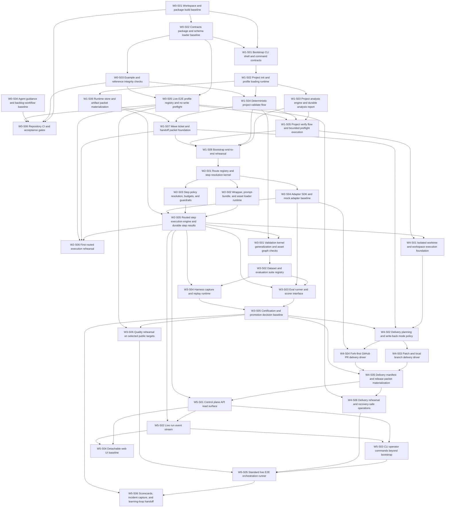

# Slice dependency graph

## Purpose
This document shows the hard-dependency structure for all defined implementation slices.

## Mermaid graph

## W0 hard dependencies
| Slice ID | Depends on |
|---|---|
| W0-S01 | none |
| W0-S02 | W0-S01 |
| W0-S03 | W0-S02 |
| W0-S04 | none |
| W0-S05 | W0-S02, W0-S03 |
| W0-S06 | W0-S01, W0-S03, W0-S04, W0-S05 |

## W1 hard dependencies
| Slice ID | Depends on |
|---|---|
| W1-S01 | W0-S01, W0-S02 |
| W1-S02 | W1-S01 |
| W1-S03 | W1-S02 |
| W1-S04 | W1-S02, W0-S03 |
| W1-S05 | W1-S03, W1-S04, W0-S05 |
| W1-S06 | W1-S02 |
| W1-S07 | W1-S04, W1-S06 |
| W1-S08 | W1-S03, W1-S04, W1-S05, W1-S07 |

## W2 hard dependencies
| Slice ID | Depends on |
|---|---|
| W2-S01 | W1-S08 |
| W2-S02 | W2-S01 |
| W2-S03 | W2-S01 |
| W2-S04 | W2-S01 |
| W2-S05 | W2-S02, W2-S03, W2-S04, W1-S06 |
| W2-S06 | W2-S05, W1-S07, W0-S05 |

## W3 hard dependencies
| Slice ID | Depends on |
|---|---|
| W3-S01 | W2-S05, W1-S04 |
| W3-S02 | W3-S01 |
| W3-S03 | W3-S02, W2-S04, W2-S05 |
| W3-S04 | W3-S02, W2-S05 |
| W3-S05 | W3-S03, W3-S04 |
| W3-S06 | W3-S05, W0-S05 |

## W4 hard dependencies
| Slice ID | Depends on |
|---|---|
| W4-S01 | W2-S05, W1-S05 |
| W4-S02 | W4-S01, W1-S07, W3-S05 |
| W4-S03 | W4-S02 |
| W4-S04 | W4-S02, W2-S04 |
| W4-S05 | W4-S03, W4-S04, W3-S05 |
| W4-S06 | W4-S05, W0-S05 |

## W5 hard dependencies
| Slice ID | Depends on |
|---|---|
| W5-S01 | W4-S05, W2-S05 |
| W5-S02 | W5-S01, W2-S05 |
| W5-S03 | W5-S01, W5-S02 |
| W5-S04 | W5-S01, W5-S02 |
| W5-S05 | W5-S03, W4-S06, W3-S06 |
| W5-S06 | W5-S05, W3-S05 |

## Topological order
1. W0-S01
2. W0-S04
3. W0-S02
4. W0-S03
5. W1-S01
6. W0-S05
7. W1-S02
8. W0-S06
9. W1-S03
10. W1-S04
11. W1-S06
12. W1-S05
13. W1-S07
14. W1-S08
15. W2-S01
16. W2-S02
17. W2-S03
18. W2-S04
19. W2-S05
20. W2-S06
21. W3-S01
22. W4-S01
23. W3-S02
24. W3-S03
25. W3-S04
26. W3-S05
27. W3-S06
28. W4-S02
29. W4-S03
30. W4-S04
31. W4-S05
32. W4-S06
33. W5-S01
34. W5-S02
35. W5-S03
36. W5-S04
37. W5-S05
38. W5-S06

## Planning rule
If a slice becomes too large during implementation, split it by introducing a new slice between existing hard dependencies rather than hiding extra work inside local tasks. Update the owning wave document, the master backlog, the epic map, and this graph together.
