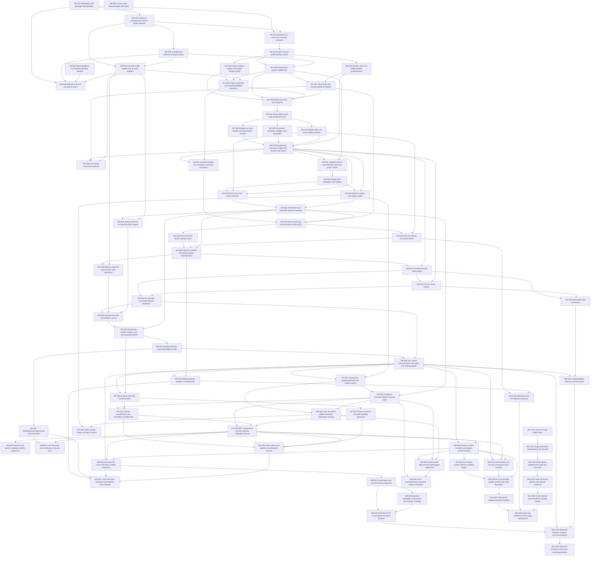

# Slice dependency graph

## Purpose
This document shows the hard-dependency structure for all defined implementation slices.

## Mermaid graph

## W0 hard dependencies
| Slice ID | Depends on |
|---|---|
| W0-S01 | none |
| W0-S02 | W0-S01 |
| W0-S03 | W0-S02 |
| W0-S04 | none |
| W0-S05 | W0-S02, W0-S03 |
| W0-S06 | W0-S01, W0-S03, W0-S04, W0-S05 |

## W1 hard dependencies
| Slice ID | Depends on |
|---|---|
| W1-S01 | W0-S01, W0-S02 |
| W1-S02 | W1-S01 |
| W1-S03 | W1-S02 |
| W1-S04 | W1-S02, W0-S03 |
| W1-S05 | W1-S03, W1-S04, W0-S05 |
| W1-S06 | W1-S02 |
| W1-S07 | W1-S04, W1-S06 |
| W1-S08 | W1-S03, W1-S04, W1-S05, W1-S07 |

## W2 hard dependencies
| Slice ID | Depends on |
|---|---|
| W2-S01 | W1-S08 |
| W2-S02 | W2-S01 |
| W2-S03 | W2-S01 |
| W2-S04 | W2-S01 |
| W2-S05 | W2-S02, W2-S03, W2-S04, W1-S06 |
| W2-S06 | W2-S05, W1-S07, W0-S05 |

## W3 hard dependencies
| Slice ID | Depends on |
|---|---|
| W3-S01 | W2-S05, W1-S04 |
| W3-S02 | W3-S01 |
| W3-S03 | W3-S02, W2-S04, W2-S05 |
| W3-S04 | W3-S02, W2-S05 |
| W3-S05 | W3-S03, W3-S04 |
| W3-S06 | W3-S05, W0-S05 |

## W4 hard dependencies
| Slice ID | Depends on |
|---|---|
| W4-S01 | W2-S05, W1-S05 |
| W4-S02 | W4-S01, W1-S07, W3-S05 |
| W4-S03 | W4-S02 |
| W4-S04 | W4-S02, W2-S04 |
| W4-S05 | W4-S03, W4-S04, W3-S05 |
| W4-S06 | W4-S05, W0-S05 |

## W5 hard dependencies
| Slice ID | Depends on |
|---|---|
| W5-S01 | W4-S05, W2-S05 |
| W5-S02 | W5-S01, W2-S05 |
| W5-S03 | W5-S01, W5-S02 |
| W5-S04 | W5-S01, W5-S02 |
| W5-S05 | W5-S03, W4-S06, W3-S06 |
| W5-S06 | W5-S05, W3-S05 |

## W6 hard dependencies
| Slice ID | Depends on |
|---|---|
| W6-S01 | W5-S06 |
| W6-S02 | W6-S01 |
| W6-S03 | W6-S01, W5-S03 |
| W6-S04 | W6-S03, W5-S04 |
| W6-S05 | W6-S03, W4-S05 |
| W6-S06 | W6-S03, W5-S06 |

## W7 hard dependencies
| Slice ID | Depends on |
|---|---|
| W7-S01 | W6-S03, W3-S04 |
| W7-S02 | W7-S01, W3-S05 |
| W7-S03 | W7-S02, W6-S06 |
| W7-S04 | W6-S06 |
| W7-S05 | W7-S02, W7-S03, W7-S04 |

## W8 hard dependencies
| Slice ID | Depends on |
|---|---|
| W8-S01 | W7-S05 |
| W8-S02 | W6-S02, W7-S05 |
| W8-S03 | W6-S03, W7-S05, W8-S08 |
| W8-S04 | W6-S03, W7-S05, W8-S08 |
| W8-S05 | W7-S01, W7-S02 |
| W8-S06 | W7-S03, W7-S04, W7-S05 |
| W8-S07 | W6-S05, W6-S02, W8-S04, W8-S06 |
| W8-S08 | W6-S03, W7-S05 |
| W8-S09 | W8-S08, W7-S02, W8-S05 |

## W9 hard dependencies
| Slice ID | Depends on |
|---|---|
| W9-S01 | W8-S08 |
| W9-S02 | none |
| W9-S03 | W8-S04 |
| W9-S04 | W9-S03 |
| W9-S05 | W3-S04, W8-S05 |
| W9-S06 | W7-S02, W8-S09 |
| W9-S07 | W9-S03, W9-S04 |
| W9-S08 | W9-S01, W8-S03, W8-S08 |

## W10 hard dependencies
| Slice ID | Depends on |
|---|---|
| W10-S01 | W9-S08 |
| W10-S02 | W4-S04, W6-S05 |
| W10-S03 | W9-S07, W6-S03, W6-S04 |
| W10-S04 | W10-S03 |
| W10-S05 | W10-S01, W10-S02, W11-S05 |

## W11 hard dependencies
| Slice ID | Depends on |
|---|---|
| W11-S01 | none |
| W11-S02 | W11-S01 |
| W11-S03 | W11-S02 |
| W11-S04 | W11-S03 |
| W11-S05 | W11-S04 |

## Topological order
1. W0-S01
2. W0-S04
3. W0-S02
4. W0-S03
5. W1-S01
6. W0-S05
7. W1-S02
8. W0-S06
9. W1-S03
10. W1-S04
11. W1-S06
12. W1-S05
13. W1-S07
14. W1-S08
15. W2-S01
16. W2-S02
17. W2-S03
18. W2-S04
19. W2-S05
20. W2-S06
21. W3-S01
22. W4-S01
23. W3-S02
24. W3-S03
25. W3-S04
26. W3-S05
27. W3-S06
28. W4-S02
29. W4-S03
30. W4-S04
31. W4-S05
32. W4-S06
33. W5-S01
34. W5-S02
35. W5-S03
36. W5-S04
37. W5-S05
38. W5-S06
39. W6-S01
40. W6-S02
41. W6-S03
42. W6-S04
43. W6-S05
44. W6-S06
45. W7-S01
46. W7-S02
47. W7-S04
48. W7-S03
49. W8-S05
50. W7-S05
51. W8-S01
52. W8-S02
53. W8-S08
54. W8-S03
55. W8-S04
56. W8-S06
57. W8-S09
58. W8-S07
59. W9-S01
60. W9-S02
61. W9-S03
62. W9-S05
63. W9-S06
64. W9-S04
65. W9-S07
66. W9-S08
67. W10-S01
68. W10-S02
69. W10-S03
70. W10-S04
71. W11-S01
72. W11-S02
73. W11-S03
74. W11-S04
75. W11-S05
76. W10-S05

## Planning rule
If a slice becomes too large during implementation, split it by introducing a new slice between existing hard dependencies rather than hiding extra work inside local tasks. Update the owning wave document, the master backlog, the epic map, and this graph together.
