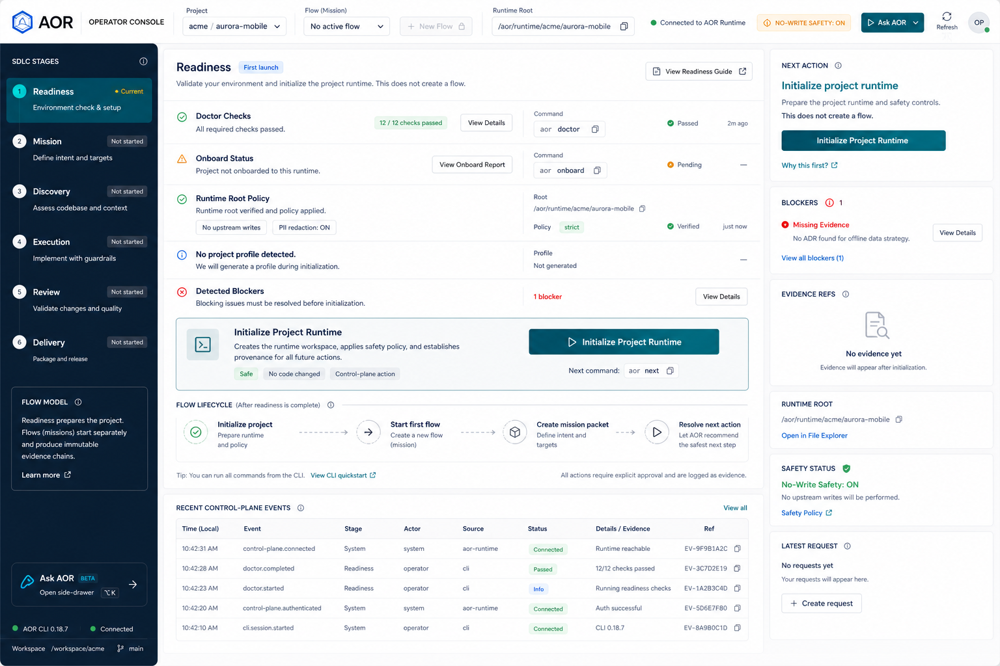
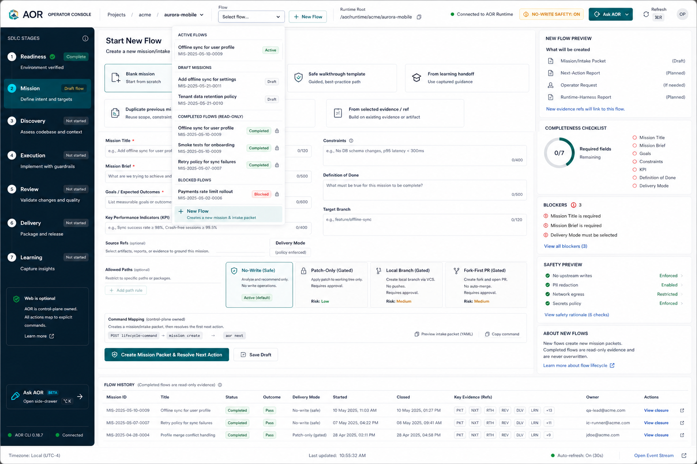
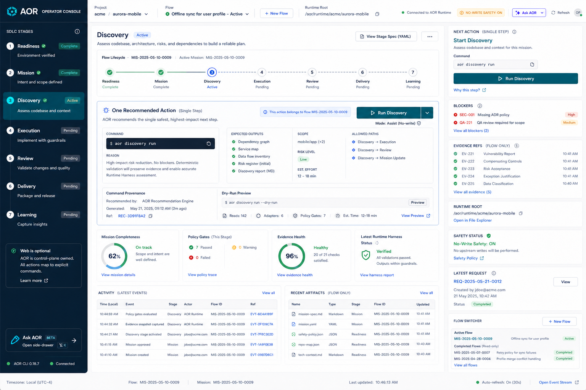
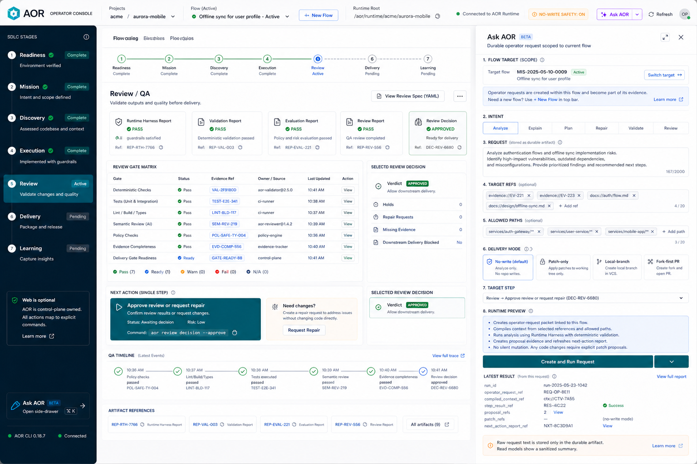
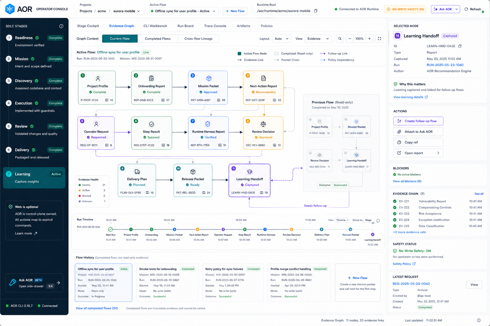
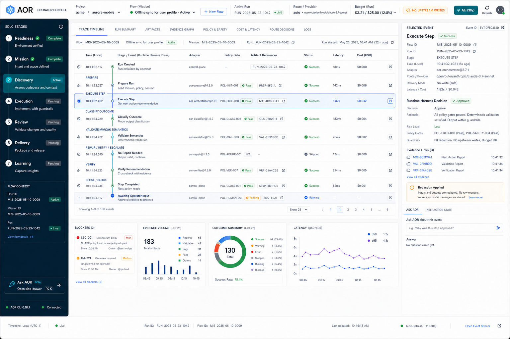
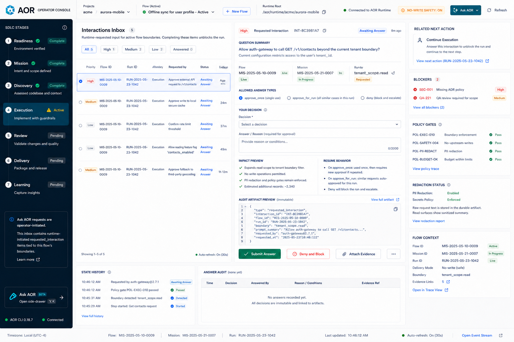
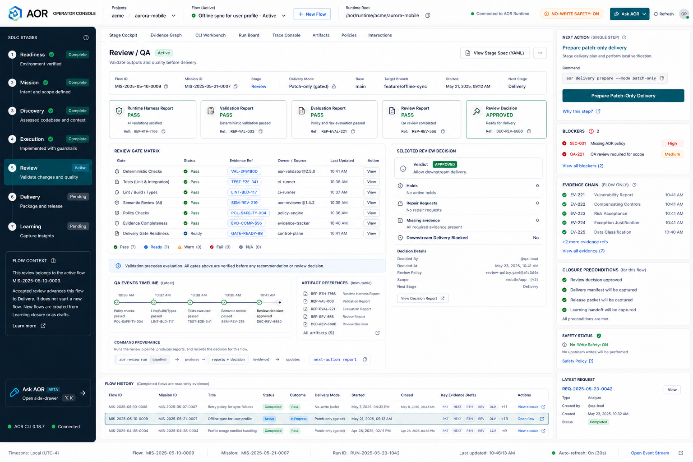
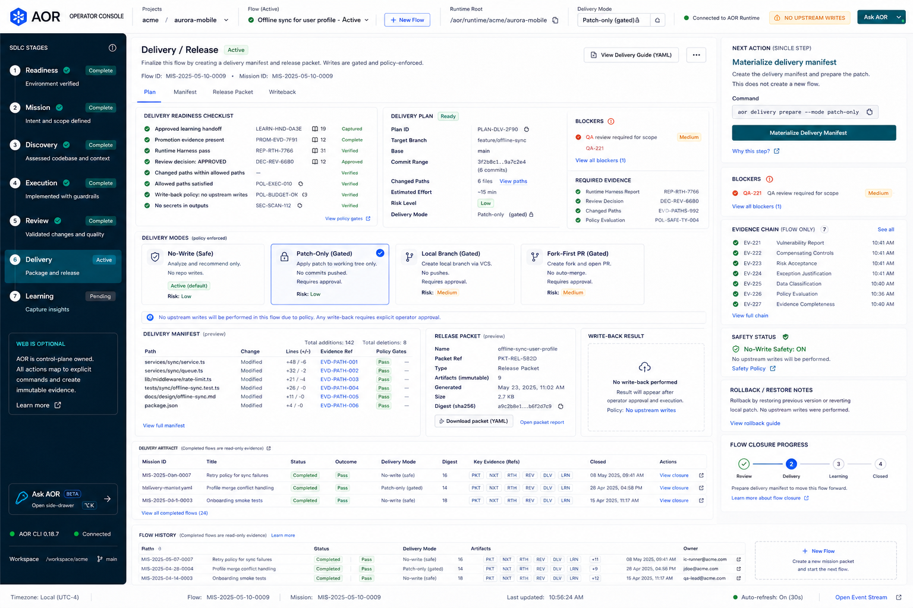
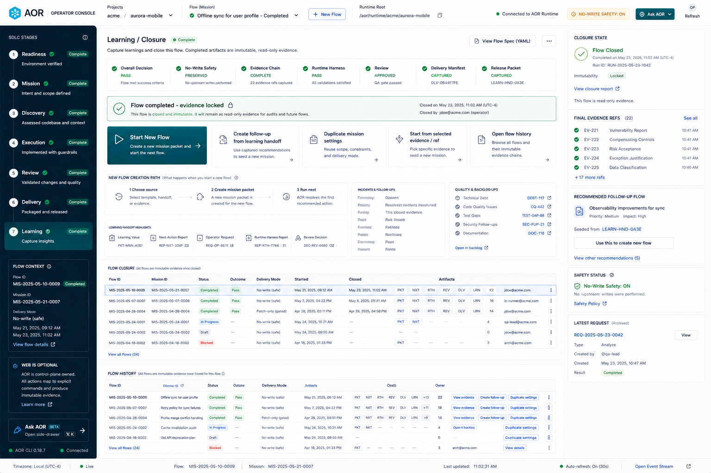

# Flow-centric operator console product baseline

## Purpose

This document freezes the accepted product direction and W34 contract baseline
for the next AOR local console iteration. W34-S01 defines the runtime-owned flow
semantics; W34-S02 implements the control-plane/runtime flow projections; W34-S03
renders the packaged flow-first local web shell; W34-S04 adds flow-scoped
evidence graph, runtime trace, interaction, and Ask AOR targeting behavior
while later W34 slices add browser-task installed-user proof.

The design keeps AOR headless-first and runtime-owned: the web app renders
control-plane read models, invokes bounded runtime mutations, and never owns
orchestration state.

## Baseline

- Design name: AOR Flow-Centric Operator Console v1.
- Baseline date: 2026-05-27.
- Owning backlog wave: W34 - flow-centric console refactor and browser-task
  proof.
- Product scope: installed-user local console launched through `aor app`.
- Runtime scope: flow projections over existing mission, next-action,
  operator-request, run, review, delivery, release, and learning evidence.

## Core interaction model

The primary object in the console is a flow.

- The top bar always exposes the selected project, runtime root, flow selector,
  and `New Flow`.
- An active flow can advance through the guided stages by invoking runtime-owned
  lifecycle mutations.
- A completed flow is rendered as a read-only evidence chain.
- Starting a new flow creates a new mission/intake packet and then refreshes the
  next-action report.
- A follow-up flow may link back to a learning handoff from a completed flow,
  but it must not mutate the completed flow.
- Operator requests must declare the selected flow, target stage, delivery mode,
  and target refs.
- Runtime-initiated interactions stay separate from operator-initiated Ask AOR
  requests.

## Flow projection baseline

A flow is a runtime/control-plane projection over durable AOR evidence. It is
not a browser session object and it is not a replacement for mission, intake,
next-action, run, review, delivery, release, or learning contracts.

The minimum projected fields are:
- `flow_id`, stable for one mission/intake lineage.
- `status`, with `active` for a mutable in-progress flow and `completed` for a
  read-only evidence chain.
- `selected_stage`, derived from the latest next-action and closure evidence.
- `mission_id`, `intake_packet_ref`, and `intake_body_ref`.
- `latest_next_action_report_ref`.
- `evidence_refs[]`, the flow-scoped evidence chain visible to CLI/API/web.
- `writeback_policy`, copied from mission scope and delivery evidence.
- `follow_up_source_handoff_ref`, present only when a new flow starts from a
  completed learning handoff.

Creating a new flow always creates fresh mission/intake evidence and then
refreshes `next-action-report`. A follow-up flow may cite a completed source
flow's learning handoff, but the completed source flow remains read-only.

## Screen references

| Screen | Reference |
|---|---|
| Readiness / first launch |  |
| Flow selector / new flow |  |
| Active flow cockpit |  |
| Ask AOR with flow target |  |
| Evidence graph with multi-flow context |  |
| Runtime trace by flow |  |
| Interactions inbox with flow boundary |  |
| Review / QA flow gate |  |
| Delivery / release finalization |  |
| Learning closure / start new flow |  |

## Required implementation qualities

- The UI must show one safe next action at a time.
- Flow state must come from control-plane/runtime read models, not browser-only
  state.
- Completed flows must remain inspectable and read-only.
- The `New Flow` path must be available from the flow selector and from learning
  closure.
- Safety gates, blockers, write-back mode, runtime root, evidence refs, and
  latest operator request status must stay visible in the main cockpit.
- Long-running external provider steps must show a query-safe heartbeat in the
  stage rail and active cockpit: provider, adapter, route, step, elapsed time,
  timeout budget, remaining time, last update, and recommended action.
- Advanced views must be flow-scoped: evidence graph, runtime trace,
  interactions inbox, and Ask AOR request targeting.
- The design must remain usable without hosted services, SSO, SaaS deployment,
  CORS expansion, or upstream writes by default.

## W34-S03 implementation trace

The packaged SPA now treats the flow as the primary object:

- The top bar exposes project identity, selected flow, runtime root, connection
  status, no-write safety status, refresh, and `New Flow`.
- `New Flow` opens mission intake as a draft and still creates durable evidence
  only through `mission create` followed by `next`.
- Active flows render an active cockpit with one recommended action, blockers,
  evidence artifacts, runtime root, write-back mode, and safety status.
- The stage rail and active cockpit render `provider_step_status` from public
  control-plane read models. `silent-running` states explicitly say the provider
  has no output yet but is still running, without exposing raw process commands
  or secrets.
- Evidence lists render `artifact_display_summaries[]` as user-facing
  artifact chips, grouped rows, and graph/trace labels. Long raw filesystem
  paths, packet URIs, and evidence URIs are not primary visible text; raw refs
  stay available only through copy/debug actions.
- The Operator Decision drawer is action-first: `Continue`, `Diagnose`,
  `Block`, `Retry public step`, `Answer`, and `Frontend interact` prepare the
  same manual installed-user decision-helper path from `agent_decision_request_ref`.
  Rejection reasons are shown as readable copy, and pending decisions expose
  copy actions for a selected-action handoff bundle, action note, and expected
  operator-decision file. Rejected decisions render a correction-required
  recovery panel with the rejected reason, rubric coverage, expected file
  availability, and copyable correction payload. Raw request refs and handoff
  payloads remain behind copy/debug actions.
- The Execution Evidence panel renders `RunSummary.execution_evidence` for the
  selected flow: provider status, Runtime Harness decision, real-code-change
  status, post-run verification, review, delivery readiness,
  no-upstream-write status, changed-path relevance groups, blockers, and public
  stop/save/diagnose/retry controls. The panel shows an execution recovery path
  before raw controls so interrupted or blocked runs name the current state,
  provider evidence to preserve, and the next public control to use.
  Scratch-only output is explicitly non-passing, while `.qwen/`, `.codex/`,
  `.claude/`, and `.opencode/` target checkout state is shown as blocking
  runner-owned leakage.
- Active review/QA repair gates render as recovery paths before raw gate
  details: the panel shows the current repair step, compact next command,
  linked repair evidence summaries from the flow projection, blocker count, and
  delivery/release exit condition so first-time operators can see why delivery
  remains blocked and what closes the loop.
- Required verification failures render as alert-level recovery paths before
  raw failed group details: the panel shows failed required command group count,
  the held downstream action, verify summary evidence, rerun command, and the
  review/QA/delivery unlock condition.
- Completed flows render as read-only closure/evidence views with mutation
  controls disabled or replaced by no-write inspection actions.
- Ask AOR submissions include `target_flow_id` for the selected flow; completed
  flows only allow no-write inspection intents.
- The stage rail remains flow-scoped navigation, not lifecycle state ownership.

## W34-S04 implementation trace

The advanced workbench is flow-scoped:

- Evidence Graph reads use
  `GET /api/projects/:projectId/flows/:flowId/evidence-graph` and render only
  selected-flow refs plus sanitized operator requests that target the selected
  flow. Empty or partial graph states render a readiness path that names the
  selected-flow scope, loaded node count, and refresh/create-evidence recovery
  step before the operator treats traceability as missing.
- Runtime Trace reads use
  `GET /api/projects/:projectId/flows/:flowId/runtime-trace` and link run
  events, step results, Runtime Harness decisions, delivery/release artifacts,
  learning artifacts, and operator requests for the selected flow. Empty trace
  states use the same readiness pattern so the operator can refresh run status
  or preserve execution evidence before judging outcome quality.
- Ask AOR requires a selected flow and target refs before creating a request;
  request creation sends `target_flow_id`, target stage, intent, delivery mode,
  allowed paths, and target refs. The drawer renders a request-readiness path
  so blocked submission states name the missing flow, request text, target refs,
  scope, or read-only-compatible mode before the operator tries to submit.
- Runtime-requested interactions remain in the Interactions Inbox and continue
  through the public `/interactions/answers` control-plane mutation. The
  detail panel renders an answer recovery path with the selected runtime
  question, step-result evidence, answer type/reason fields, and the audit-ref
  refresh condition that unlocks continuation.
- Sanitized read payloads omit raw operator request text while preserving
  summaries and refs.

## W34-S05 implementation trace

Learning closure now provides an explicit safe transition into the next flow:

- Completed flow projections expose `closure_state.follow_up_eligible`,
  `source_learning_handoff_refs[]`, `recommended_follow_up_source_handoff_ref`,
  and duplicate-safe `mission_settings`.
- `aor next` resolves completed learning closure to a `start-new-flow` primary
  action backed by `mission create --follow-up-source-handoff-ref <ref>` when a
  learning handoff exists.
- The web closure cockpit keeps completed evidence read-only and offers
  `Start New Flow`, `Create follow-up from learning handoff`, and
  `Duplicate mission settings`.
- Follow-up and duplicate submissions still go through the public lifecycle
  command mutation, create fresh mission/intake packets, run `next`, and keep
  `upstream_writes_default=false`.

## Installed-User Proof Implications

The installed-user guided proof should be refreshed through the current
skill-agent-only installed-user model so it proves the full flow-centric loop:

1. Launch `aor app` and validate the browser-task frontend proof path.
2. Create and complete the first flow through durable evidence.
3. Render the completed flow as read-only.
4. Start a second flow from learning closure or the flow selector.
5. Prove that the second flow writes a new mission/intake packet.
6. Prove that operator-request targeting includes the selected flow.
7. Preserve the existing no-upstream-write default.
8. Preserve AOR operator UI evidence refs for rendered HTML, DOM snapshot,
   accessibility summary, screenshot or visual evidence, task outcome, UX
   findings, and inspected browser-task evidence.
9. Preserve run-health refs and post-run quality assessment refs with non-empty
   inspected evidence refs for evaluated dimensions.

## W34-S06 implementation trace

The installed-user guided profile now makes the flow loop part of the proof
contract:

- The installed-user guided profile declares browser-task, flow-loop,
  flow-targeted request, quality-assessment, and no-upstream-write
  requirements without expanding the public CLI/runtime surface.
- Guided proof generation records the first completed flow, completed-flow
  read-only state, a distinct follow-up flow, the learning handoff lineage,
  the second-flow intake/next-action files, and
  `operator_request.target_flow_id`.
- Frontend evidence records rendered HTML, DOM snapshot, accessibility summary,
  screenshot or visual guardrail refs, task outcome, UX findings, and a
  browser-task proof ref.
- Acceptance remains fail-closed when browser-task proof, flow-loop fields,
  run-health evidence, required assessment refs, inspected refs, or no-upstream-write
  assertions are missing.

## Out of scope

- Implementing the redesign in this document.
- Introducing UI-owned orchestration state.
- Replacing CLI/API/headless operation.
- Reintroducing static HTML console snapshots.
- Adding hosted SaaS, multi-tenant collaboration, SSO, or default upstream
  write-back.
