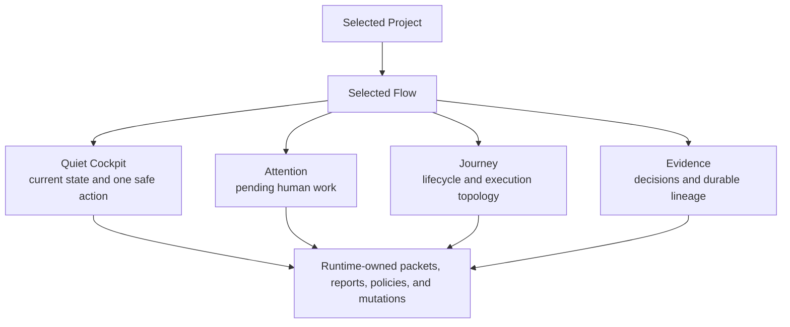
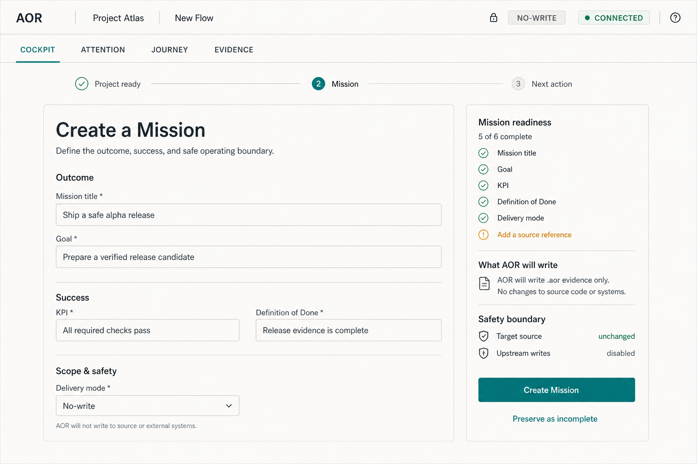
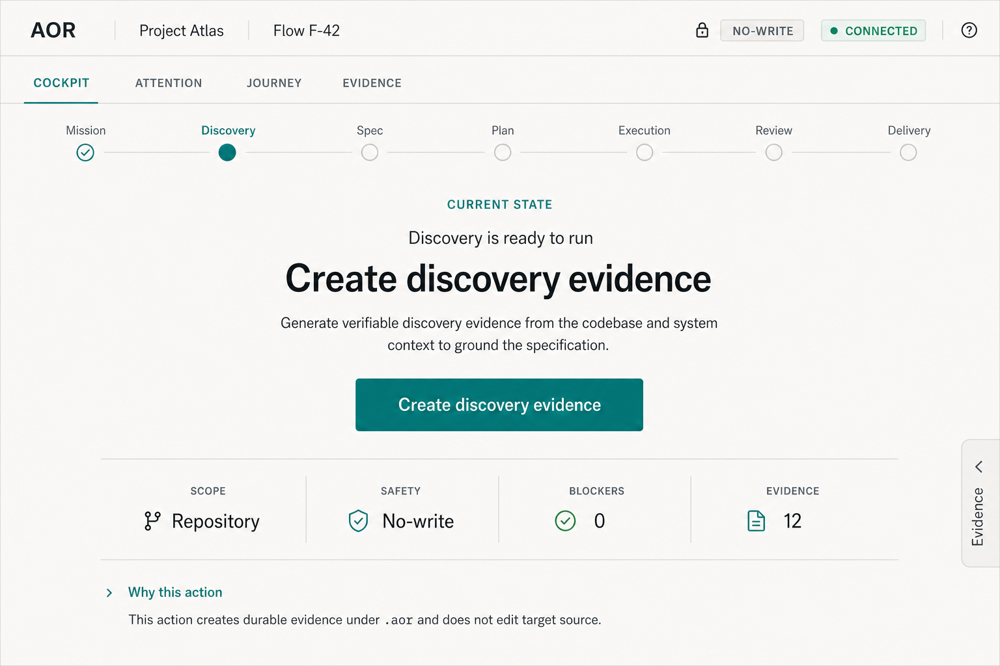
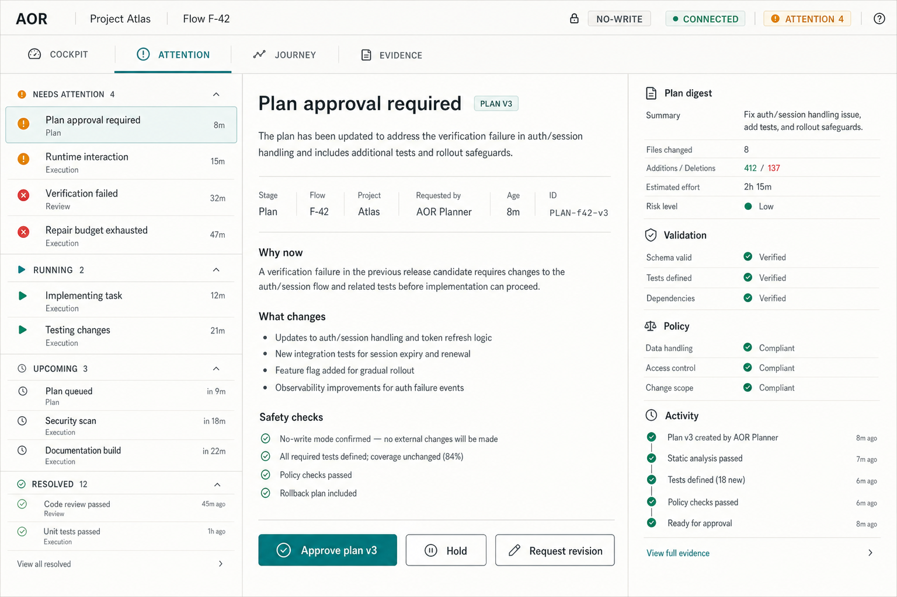
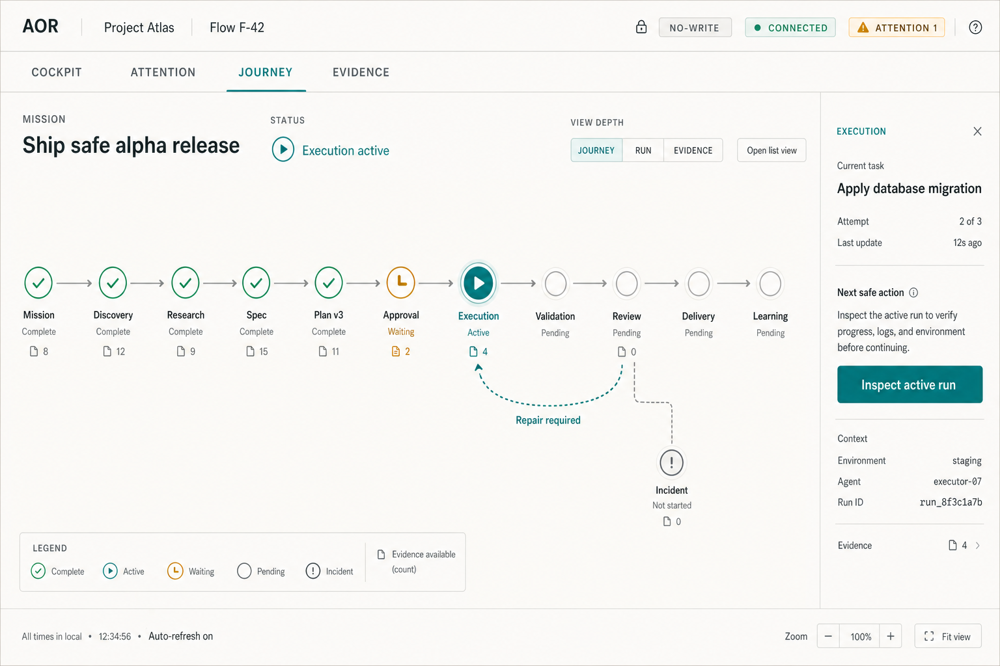
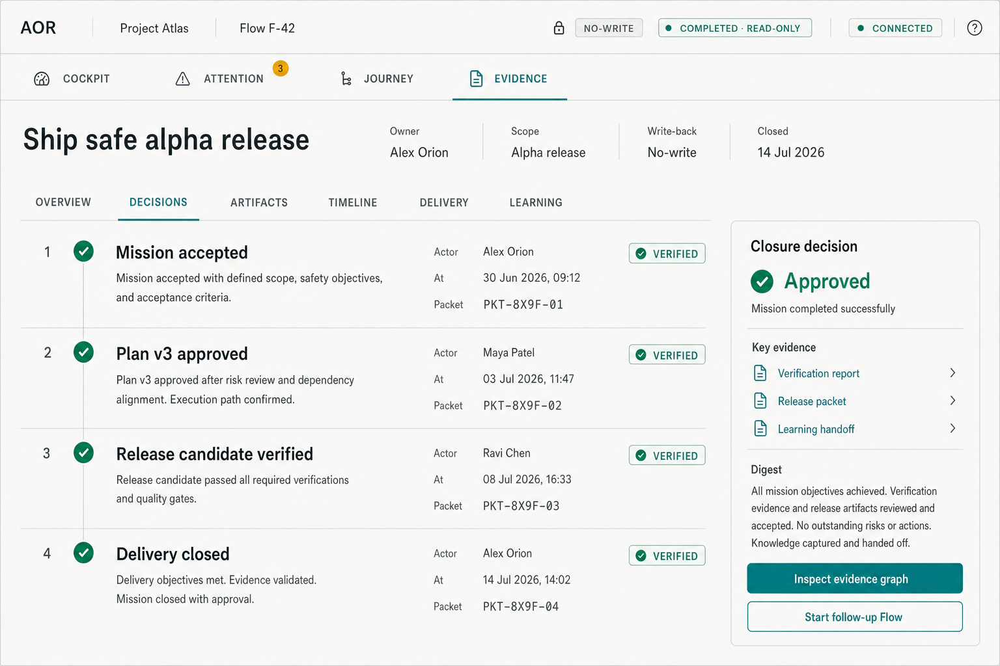
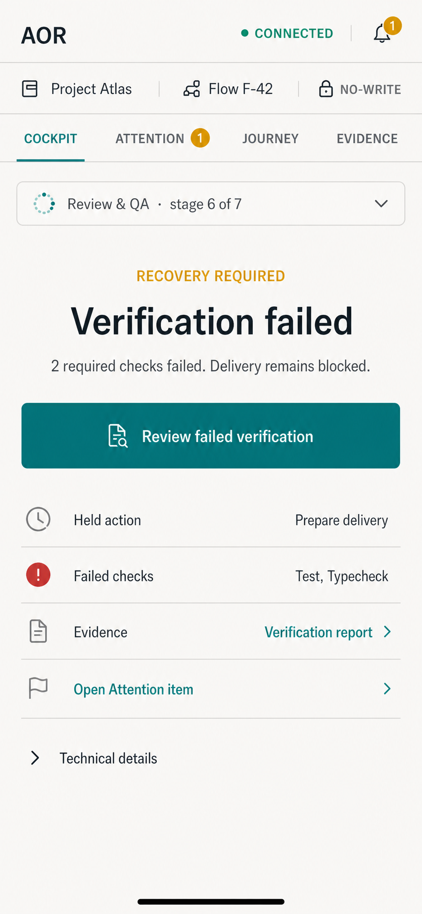

# Quiet Cockpit operator console target design

## Status

- **Design name:** AOR Quiet Cockpit Operator Console v2.
- **Decision date:** 2026-07-14.
- **Status:** adopted product and UX target; not implemented or release-qualified.
- **W63-S01 baseline:** journey, action, ownership, state, and executable
  scenario contract accepted; visual migration remains unimplemented.
- **Owning implementation wave:** W63 - operator-console UX and UI maturity.
- **Owning migration wave:** W65 - installed-console migration and cutover.
- **Current implemented baseline:** W34 Flow-Centric Operator Console v1 in
  `03-flow-centric-console-design.md`.
- **Primary surface:** the packaged responsive local console launched through
  `aor app`.

This document defines the intended successor to the W34 visual and interaction
model. It does not claim that W63 or W65 is active or complete, and it does not
change the current release hold, runtime contracts, slice dependencies, or
packaged SPA behavior.

## Decision

After W65 cutover, the console uses **Quiet Cockpit** as its installed default
shell and exposes three flow-scoped specialist modes:

1. **Attention** for pending human decisions, interactions, failures, and
   recovery work.
2. **Journey** for lifecycle, plan, execution, integration, and delivery
   topology.
3. **Evidence** for decisions, packets, verification, delivery, release, and
   learning lineage.

The modes are different ways to read and act on one selected Flow. They are not
new lifecycle objects, packet families, or orchestration owners.

## Product brief

| Area | Decision |
|---|---|
| Product type | Local developer tool and SDLC operations console. |
| Primary users | Operator/SRE first; reviewer/QA second. |
| Secondary users | Sponsor, planner, delivery engineer, repository owner, security, and audit users through focused summaries or workbenches. |
| Primary job | Understand the selected Flow, take exactly one truthful safe action, recover without duplicate evidence, and inspect proof on demand. |
| Platform | Responsive web UI packaged with the npm CLI; equivalent CLI/API behavior remains available. |
| Safety boundary | Loopback-only, same-origin, headless-first, no upstream writes by default, explicit write-back mode, completed-flow immutability. |
| Data boundary | The UI renders control-plane read models and invokes bounded runtime mutations. It never owns lifecycle truth. |
| Success signal | State, safety, and the next operator outcome are understandable before advanced details; evidence remains reachable without raw JSON. |

## Target user outcome

An installed local operator can understand the state of the selected Flow,
perform exactly one truthful safe action, process every pending decision,
inspect lifecycle and evidence on demand, and continue with a new Flow without
mutating completed history.

## Roles and top jobs

| Role | Top jobs in this concept | Primary mode |
|---|---|---|
| Operator / SRE | Resume a Flow, see the current action, monitor execution, handle blockers and interactions, preserve evidence, and recover safely. | Cockpit and Attention |
| Reviewer / QA | Inspect findings, compare deterministic and semantic quality evidence, decide, request repair, and verify closure. | Attention and Evidence |
| Engineering manager / planner | Review exact plan version, dependency order, scope, acceptance coverage, and progress derived from evidence. | Journey |
| Delivery engineer | Inspect workspace, integration, repository-level write effects, delivery readiness, and partial recovery. | Journey and Evidence |
| Product sponsor / owner | Understand Mission outcome, approval state, delivery risk, and closure without operational noise. | Cockpit and Evidence |
| Security / audit / incident owner | Trace policy, approval, verification, delivery, incident, and learning evidence. | Evidence |

These are UX personas, not a browser authentication or RBAC model. Hosted
accounts, multi-user collaboration, SSO, and remote console access remain out
of scope.

## Non-negotiable invariants

1. The selected Project remains the top-level context.
2. The selected Flow remains the only primary lifecycle object inside a
   Project.
3. The first reading order is always **current state -> one safe action ->
   evidence on demand**.
4. An action label describes the observable outcome or explicitly says that it
   opens, inspects, refreshes, or copies something.
5. Exactly one action or blocked recovery path is visually dominant in the
   Cockpit.
6. Attention is derived from durable runtime evidence; browser-only dismissal
   must not hide an authoritative blocker.
7. Switching modes changes presentation, not Flow state, stage, next action, or
   safety policy.
8. Completed flows are read-only. Follow-up work creates fresh Mission/intake
   evidence and may cite a learning handoff.
9. `no-write` still permits AOR evidence under `.aor/`; it does not permit
   target-source or upstream writes.
10. Narrow viewports recompose authoritative state instead of removing it.

## Information architecture

### Global context bar

The persistent context bar contains only information needed before any action:

- AOR identity and local-app status;
- selected Project and Project switcher;
- selected Flow and Flow switcher;
- connection freshness;
- safety/write-back mode;
- Attention count when non-zero;
- utilities such as refresh and labelled technical context disclosure.

Runtime root, long paths, raw IDs, package version, and debug metadata remain
available in **Project context** or **Technical details** disclosures. They do
not compete with Project, Flow, connection, safety, or the primary action.

### Mode navigation

The first-level Flow navigation is:

- **Cockpit**
- **Attention** with a neutral count or semantic severity
- **Journey**
- **Evidence**

Project Structure is project-scoped and sits outside these Flow modes. Ask AOR
is an operator-request action available from relevant Flow context; it is not a
fifth mode and is not merged with runtime-requested interactions.

### Lifecycle selector

The lifecycle path is a compact, accessible selector rather than a decorative
progress meter. It distinguishes:

- the runtime-owned current stage;
- the operator-selected inspection stage;
- completed, active, blocked, waiting, and unavailable stages;
- grouped overview and deeper task/run detail.

Every graph or visual path has an equivalent list or table representation.

## Mode 1: Quiet Cockpit

### Purpose

Quiet Cockpit is the default landing surface for first run, resume, active
work, blocked recovery, and completed closure. Its primary object is the next
safe operator outcome.

### Reading order

1. **Context:** Project, Flow, connection, and safety.
2. **Current state:** one plain-language sentence and lifecycle position.
3. **Primary action or recovery:** one outcome-named control with explicit side
   effect.
4. **Compact facts:** scope, provider/run status, blockers, evidence count, and
   freshness when applicable.
5. **Supporting explanation:** why this action is safe and what unlocks next.
6. **Evidence on demand:** concise artifacts, refs, logs, commands, and debug
   details behind labelled disclosure.

### Core anatomy

- `ContextBar`
- `ModeNav`
- `LifecycleSelector`
- `CurrentStateSummary`
- `PrimaryActionRegion`
- `FactStrip`
- optional `RecoverySummary`
- `EvidenceDrawer` or local disclosure
- non-competing secondary actions

### State variants

- **First run:** explicit readiness and Initialize action; read operations do
  not create `.aor/`.
- **Mission required:** structured Mission builder is the primary path.
- **Ready:** one outcome-named lifecycle mutation.
- **Provider running:** live heartbeat, elapsed/budget, last update, and safe
  run controls replace stale next-action copy.
- **Blocked:** blocker consequence and exact recovery action replace normal
  stage advancement.
- **Partial mutation:** already-created durable refs remain visible; only the
  unfinished safe operation is offered.
- **Completed:** immutable outcome summary, Evidence entry, and Start follow-up
  Flow action.

## Mode 2: Attention

### Purpose

Attention is the operator's flow-scoped work queue. It separates pending human
work from activity history and from operator-initiated Ask AOR requests.

### Included item families

- runtime-requested interaction;
- operator decision or approval;
- product-quality assessment;
- failed required verification;
- quality repair required or budget exhausted;
- review/QA hold;
- delivery or release gate;
- partial/offline read requiring recovery;
- permission or policy blocker.

### Queue structure

- **Needs attention**
- **Running**
- **Upcoming**
- **Resolved**

Selecting an item opens a detail workspace containing the plain-language
outcome, why it is required, authoritative source refs, safety consequence,
one primary action, and durable completion feedback. Every item preserves its
own selected ID, draft answer, run/request/interaction refs, age, owning stage,
and recovery state.

The first version has no browser-only **Snooze**. Filtering and collapsing
resolved items may change presentation, but cannot suppress an authoritative
pending item. Durable defer semantics require a future contract-first decision.

### Attention ownership

Attention is a derived projection over existing interactions, run health,
decisions, repairs, requests, and partial-read state. It is not a new packet.
If the control plane cannot produce a deterministic unified queue, an additive
read projection must be specified contract-first before implementation.

## Mode 3: Journey

### Purpose

Journey explains where the Flow is, how work depends on other work, what is
running, and what prevents integration or delivery. It is a focused workbench,
not the default home page.

### Three zoom levels

1. **Journey:** Mission through learning, including approvals, repair loops,
   incident branches, and delivery boundaries.
2. **Run:** structured tasks, execution units, dependency lanes, attempts,
   verification, integration, and scheduler decisions.
3. **Evidence:** packet and decision lineage attached to the selected journey
   node.

### Interaction model

- selecting a node opens an inspector with status, owner, blockers, evidence,
  and the next relevant action;
- graph state never substitutes for exact plan version, task status, or
  evidence-derived completion;
- proposed parallelism is visibly distinct from approved parallel execution;
- partial child or repository success never appears as aggregate success;
- stale tasks and invalidated downstream work remain visible with recovery;
- list/table views expose the same dependencies, status, and actions for
  keyboard, screen-reader, and narrow-layout use.

Journey's structured planning, topology, task DAG, workspace-set, and
coordinated delivery views depend on W60-W62. Reference screens in this
document are target-state illustrations, not current implementation claims.

## Mode 4: Evidence

### Purpose

Evidence presents a reviewable decision and artifact chain from Mission to
closure. Its case-file metaphor is presentation only; it does not introduce a
new artifact family.

### Sections

- **Overview:** Mission, scope, safety, current verdict, and closure status.
- **Decisions:** approvals, holds, overrides, review/QA decisions, and
  rationales.
- **Artifacts:** packets, reports, diffs, logs, traces, and verification.
- **Timeline:** chronological runtime, operator, delivery, and incident events.
- **Delivery:** delivery plan, write effects, manifest, release packet, and
  rollback/recovery evidence.
- **Learning:** scorecard, incident links, backfill proposal, recertification,
  and follow-up handoff.

The default presentation uses human titles and concise artifact summaries.
Raw refs, filesystem paths, digests, and JSON are available through labelled
inspection and copy actions. Sanitized read models must not expose raw operator
request text or secrets.

For a completed Flow, Evidence becomes the natural read-only home. Follow-up
creation starts a new Flow and preserves lineage without changing the source
ledger.

## Main journeys

### Clean first run and Mission creation

1. Launch `aor app` in a target repository.
2. Read project and readiness state without creating runtime artifacts.
3. Review the runtime root and write-effect preview.
4. Initialize explicitly.
5. Build a complete Mission or explicitly preserve a contract-valid incomplete
   Mission with named blockers.
6. Create Mission evidence.
7. Resolve `next`; if it fails, keep created refs and retry only `next`.
8. Land in Quiet Cockpit with one current action.

### Active provider execution

1. Cockpit replaces stale stage action with current provider heartbeat.
2. Compact facts show provider, step, elapsed/budget, last update, and safety.
3. Journey opens at the active task or attempt.
4. Evidence exposes logs, compiled context, step result, and Harness decision.
5. Stop, diagnose, answer, or retry appears only when the canonical mutation is
   available and policy allows it.

### Multiple pending items

1. Attention count appears in the shell without replacing the current Flow.
2. Attention opens with the highest-consequence unresolved item selected.
3. Completing an item writes or reads back durable evidence.
4. The queue advances to the next item without losing independent drafts or
   refs.
5. Resolved history stays inspectable.

### Verification failure and repair

1. Cockpit changes to a blocked recovery summary.
2. Attention identifies the failed verification or required decision.
3. Journey shows the affected task, downstream hold, and repair loop.
4. Evidence preserves failed commands, changed paths, review findings, repair
   request, attempts, and accepted closure.
5. Exhausted budget remains blocked until explicit operator evidence permits a
   supported next path.

### Partial delivery

1. Journey shows repository-level delivery results and aggregate failure.
2. Successful outputs remain evidence but are not presented as mission
   completion.
3. Cockpit presents the exact rollback, repair, hold, or inspect action.
4. Evidence records write effects, locks, manifests, and recovery outcome.

### Completed Flow and follow-up

1. Cockpit shows immutable completion and a concise outcome summary.
2. Evidence becomes the primary inspection destination.
3. Mutation controls disappear or become inspection-only.
4. Start follow-up creates fresh Mission/intake evidence and cites the selected
   learning handoff.

## Screen inventory

| Surface | Purpose | Primary action |
|---|---|---|
| Readiness Cockpit | Confirm project, runtime root, and explicit initialization. | Initialize project runtime |
| Mission builder | Create complete Mission evidence or acknowledge incomplete blockers. | Create Mission |
| Active Cockpit | Understand current state and take one safe action. | Outcome named by authoritative next action |
| Running Cockpit | Monitor live provider/run state. | Inspect run or supported run control |
| Blocked Cockpit | Understand consequence and recover safely. | Outcome-named recovery |
| Attention queue | Complete pending interactions, decisions, assessments, and blockers. | Action owned by selected item |
| Journey workbench | Inspect lifecycle, plan, task/run, integration, and delivery topology. | Inspect or act on selected node |
| Evidence ledger | Review decisions and durable lineage. | Inspect evidence or create follow-up |
| Completed Cockpit | Summarize immutable closure. | Start follow-up Flow |
| Project Structure | Manage project-scoped repositories, components, bindings, and validation. | Context-specific project mutation |

## Action taxonomy

| Category | Required label | Visual treatment | Feedback |
|---|---|---|---|
| Execute mutation | Name the result, for example **Create discovery evidence** or **Approve plan v3**. | Single primary filled action. | Pending, partial, durable success refs, structured error, safe retry. |
| Open workbench | Begin with **Open**, **Review**, or **Inspect**, for example **Review failed verification**. | Secondary or context action. | Move focus to named surface and preserve return point. |
| Inspect evidence | Name the artifact or scope, for example **Inspect verification report**. | Quiet secondary action or link. | Open flow-scoped sanitized evidence; raw detail remains optional. |
| Copy command/ref | Begin with **Copy**, never with a runtime verb such as Stop or Retry. | Utility action with copy icon. | Confirm exactly what was copied without implying execution. |
| Refresh state | Use **Refresh state**, **Check status**, or **Resolve next action** only when that is the actual operation. | Utility action; never dominant during required recovery. | Announce freshness, failure, and whether authoritative state changed. |
| Unavailable | Keep the intended outcome visible with the missing precondition. | Disabled with adjacent explanation; not color-only. | Name the approval, permission, connection, evidence, or lifecycle state required. |

## Information ownership map

| UI information | Authoritative owner | Presentation rule |
|---|---|---|
| Project and local runtime context | app config, project index, project profile, onboarding/readiness evidence | Project identity is primary; paths are disclosed. |
| Selected Flow and stage | flow projection plus current next-action and closure evidence | Mode selection never changes lifecycle state. |
| Primary action | `next-action-report`, run health, interaction, repair, review, delivery, or closure evidence | Resolve precedence deterministically; never parse shell text to infer a mutation. |
| Mission completeness and scope | `intake-request-body` and canonical scope contract | Explain missing groups and write effects before mutation. |
| Safety and write-back | Mission scope, policy, delivery plan/manifest, and no-upstream-write evidence | Persistent, text-labelled, and never inferred from color. |
| Attention item | interaction, pending decision, assessment, verification, repair, request, partial-read, or policy evidence | Derived read projection; completion requires durable readback. |
| Journey plan and task state | `wave-ticket`, `handoff-packet`, `execution-plan`, `task-progress-report`, run and workspace projections | Exact version/digest and evidence-derived completion. |
| Evidence ledger | Flow `evidence_refs[]`, graph/trace, validation, review, delivery, release, incident, and learning artifacts | Human summary first; raw refs on demand. |
| Live state | run health and `live-run-event` | Show freshness, stale/offline status, and last known evidence. |

### Executable ownership decisions

| Surface | Packet/report owner | Read/route owner | Mutation owner | Recovery owner and compatibility |
|---|---|---|---|---|
| Mission intake | `intake-request-body`, Mission/intake packets | selected Flow plus project state | existing `mission create`, then `next` | `OperatorError`; partial retry reuses created refs. No new field in S01. |
| Quiet Cockpit | `next-action-report`, run health, closure evidence | existing project/Flow reads | existing lifecycle command catalog only | Catalog recovery actions; W34 output remains compatible until W65 cutover. |
| Attention | interaction, decision, verification, repair and policy evidence | existing per-family reads in S01 | existing answer/decision/repair operations | A unified projection is an additive contract gap owned by W63-S06 if deterministic composition remains insufficient. |
| Journey | task/execution plan, progress, workspace set, parent run, integration and delivery reports | W60-W62 plan/run/delivery reads | revisioned plan/run/integration/delivery operations | Existing typed conflicts and recovery refs; no new orchestration truth. |
| Evidence | Flow evidence refs, graph/trace, quality, delivery, incident and learning artifacts | existing evidence/quality/history reads | inspect/copy only, except contract-owned follow-up creation | Sanitized summaries remain compatible; raw refs are disclosed on demand. |
| Presentation mode | none; presentation-only | URL/local view selection | none | No durable lifecycle effect. A shareable descriptor requires a later additive read-only contract decision. |

S01 resolves the earlier Journey uncertainty through the accepted W60-W62
contracts. It deliberately leaves two registered additive gaps: deterministic
unified Attention aggregation and structured action-category metadata. Later
slices must update their owning read/report contracts before the SPA depends on
either; command-string parsing and browser-owned recovery remain forbidden.

## State and recovery matrix

| State | Required UI behavior | Recovery |
|---|---|---|
| Initial loading | Show non-actionable syncing state; do not guess that the Project or Flow is empty. | Wait, retry read, or show structured failure. |
| Empty / first run | Show one explicit initialization path and write-effect preview. | Initialize or continue headlessly. |
| Mission invalid | Show error summary, inline errors, and focus the first invalid field. | Correct fields; no mutation occurs. |
| Mission incomplete | Name missing evidence and downstream blockers. | Explicitly preserve incomplete state or complete the Mission. |
| Ready | Show one outcome-named primary action. | Execute through canonical mutation. |
| Running | Show heartbeat, elapsed/budget, last update, and supported controls. | Inspect, answer, pause/cancel, or wait according to policy. |
| Multiple attention items | Preserve independent identity, draft, source, and status for every item. | Complete selected item and read back durable result. |
| Partial mutation | Keep successful refs and mark only the unfinished step pending. | Resume idempotently; never recreate completed evidence. |
| Blocked | Explain consequence, source evidence, and exact recovery. | Perform supported recovery or continue in terminal explicitly. |
| Permission denied | Keep state readable and name missing scope without exposing secrets. | Change authorized configuration outside the UI or choose an allowed action. |
| Partial read | Show loaded sections and label unavailable sections; do not collapse to empty healthy state. | Retry only failed reads. |
| Offline / stale | Keep last-known state visibly stale and disable unsafe mutations. | Reconnect, refresh, and revalidate before acting. |
| Completed | Render immutable outcome and evidence chain. | Inspect or create a new follow-up Flow. |

## Executable scenario baseline

`apps/web/browser/fixtures/operator-scenarios.json` is the deterministic W63
scenario catalog. Its loader rejects duplicate IDs, missing evidence, unknown
action categories, misleading copy/workbench/refresh labels, available actions
without operations, unavailable actions without blockers, and missing
viewport/keyboard coverage. Browser fixtures are injected only into the W59
disposable installed-app harness; they are not runtime packets or product data.

| Scenario | Entry and primary outcome | Required recovery/success proof |
|---|---|---|
| `clean-first-run` | Uninitialized readiness -> Initialize project runtime | Write preview; no implicit runtime creation. |
| `mission-invalid` / `mission-complete` | Invalid fields or complete Mission -> focus error or create evidence | No invalid mutation; durable Mission/intake refs. |
| `active-flow` | Active discovery -> Create discovery evidence | One stable Flow and one next-action transition. |
| `partial-mutation` | Mission exists, next action incomplete -> Resolve next action | Resume only unfinished work; no duplicate refs. |
| `queued-human-work` | Multiple interactions/decisions -> Review selected item | Independent drafts/IDs and durable queue advance. |
| `provider-progress` | Active provider -> Inspect active run | Durable heartbeat, terminal state, and reconnect cursor. |
| `verification-failure` | Required check failed -> Review failed verification | Structured consequence and fresh passing replacement. |
| `bounded-repair` | Repair required -> Run approved repair | Stable task/unit identity and exhausted-budget block. |
| `completed-read-only` / `follow-up-flow` | Immutable closure -> inspect or start follow-up | Source closure unchanged; new Flow cites handoff. |
| `partial-offline-reads` | Last-known state is partial/offline -> Refresh state | Failed-resource retry and safety revalidation. |

Every scenario names entry state, authoritative evidence, exactly one primary
action category, blockers, expected recovery, success signal, and viewport plus
keyboard coverage. The catalog disables external network and upstream writes.

## Responsive behavior

### Desktop: 1181px and wider

- context, modes, lifecycle, workspace, and optional inspector may coexist;
- Quiet Cockpit remains spacious and action-first;
- Attention may use a three-column queue/detail/evidence layout;
- Journey may use graph plus inspector, with the list/table alternative one
  control away;
- Evidence may use main ledger plus pinned summary.

### Tablet: 768px to 1180px

- inspector becomes a drawer or lower split pane;
- lifecycle selector remains interactive and horizontally scrolls only inside
  its labelled region when necessary;
- secondary facts wrap into two rows;
- tables reduce columns and move secondary data into row detail.

### Mobile: 320px to 767px

- context bar becomes two compact rows without hiding Project, Flow,
  connection, safety, or Attention count;
- mode navigation remains a labelled tab/selector;
- lifecycle becomes a vertical or horizontal accessible selector;
- primary action remains in document order before advanced evidence and may use
  a safe-area-aware sticky action bar;
- Attention becomes queue -> item -> evidence navigation with a persistent back
  path;
- Journey defaults to the accessible list/timeline, not a compressed graph;
- Evidence uses sections and disclosures rather than a wide ledger table;
- authoritative blockers, decisions, safety, and freshness never disappear via
  `display:none`.

Acceptance viewports are 320px, 390x844, 768x1024, 1024x768, 1180/1181px, and
1440x900, plus 200% zoom/reflow.

## Visual system

### Direction

The interface is calm, technical, and outcome-oriented. Visual hierarchy comes
from whitespace, typography, alignment, and restrained surfaces rather than a
grid of equally weighted cards. All modes share one light theme in v1; modes do
not switch visual themes.

### Semantic color tokens

| Token | Reference value | Use |
|---|---|---|
| `color.bg.canvas` | `#F4F6F3` | Application canvas. |
| `color.bg.surface` | `#FFFFFF` | Primary workspace and controls. |
| `color.bg.subtle` | `#EEF2EF` | Grouping and quiet hover/selected backgrounds. |
| `color.text.primary` | `#17201D` | Headings and body. |
| `color.text.secondary` | `#56625D` | Supporting copy and metadata. |
| `color.border.default` | `#D7DED9` | Dividers and control boundaries. |
| `color.action.primary` | `#0F766E` | The single primary action. |
| `color.action.primary-hover` | `#0B5F59` | Primary hover/active. |
| `color.action.on-primary` | `#FFFFFF` | Primary action text/icon. |
| `color.selection.bg` | `#E4F3F0` | Selected queue rows, tabs, and nodes. |
| `color.selection.fg` | `#0B5F59` | Selected content. |
| `color.status.info` | `#175CD3` | Informational live state. |
| `color.status.success` | `#217A4A` | Verified or completed state. |
| `color.status.warning` | `#8A5F14` | Waiting, attention, or recoverable risk. |
| `color.status.danger` | `#B42318` | Failure, destructive consequence, or terminal blocker. |
| `color.focus` | `#0067C5` | Consistent visible focus indicator. |

Status always combines tone with text and an icon, shape, or pattern. Counts
remain neutral unless the underlying state has semantic severity.

### Typography

The implementation reuses the existing system/Inter-compatible sans stack and
monospace stack; it does not require a new font dependency.

| Role | Size / line height | Weight | Use |
|---|---|---|---|
| Action display | 36 / 44px | 650 | Cockpit outcome on large screens. |
| Page title | 28 / 36px | 650 | Mode or case title. |
| Section heading | 20 / 28px | 650 | Major workspace sections. |
| Subheading | 17 / 24px | 600 | Local groups and inspectors. |
| Body | 15 / 22px | 400 | Default explanatory copy. |
| Compact body | 14 / 20px | 400 | Queue, ledger, and operational tables. |
| Label | 13 / 18px | 600 | Field, column, and fact labels. |
| Meta | 12 / 16px | 500 | Timestamps and secondary metadata only. |
| Code | 13 / 18px | 500 | IDs, refs, digests, and commands. |

Normal content must not depend on 11px text, synthetic extreme weights, or
uppercase section headings. Operational numbers use tabular figures.

### Spacing, radius, elevation, and motion

- spacing scale: `4, 8, 12, 16, 24, 32, 48, 64px`;
- control radius: `6px`; workspace/section radius: `10px`; pill radius only for
  badges and counts;
- controls: minimum `40px` on desktop and `44px` for touch targets;
- elevation: border-first; one restrained overlay shadow for drawers/dialogs;
- motion: `120ms` micro feedback, `180ms` disclosure, `240ms` drawer; reduced
  motion removes non-essential movement;
- no decorative progress animation; live motion indicates only active work.

### Density

- **Comfortable:** first run, Mission, Cockpit, blocked recovery, and completed
  summary.
- **Compact:** Attention, Evidence records, task lists, event lists, and
  operational tables.

Density changes spacing and row height, not information ownership, text below
readability, or touch-target size.

## Component contracts

| Component | Purpose and critical states |
|---|---|
| `ContextBar` | Project, Flow, connection, safety, Attention, and technical disclosure; wraps without losing authoritative state. |
| `ModeNav` | Cockpit, Attention, Journey, Evidence; selected, focus, count, narrow selector. |
| `LifecycleSelector` | Runtime stage versus selected inspection stage; completed, active, waiting, blocked, unavailable. |
| `PrimaryActionRegion` | Current outcome, explanation, consequence, one primary action; ready, pending, partial, success, blocked, error, read-only. |
| `FactStrip` | Compact labelled facts without decorative metrics; responsive wrapping and disclosed detail. |
| `AttentionQueue` / `AttentionItem` | Multi-item selection, independent draft/ref/status, severity, age, stage, resolved readback. |
| `JourneyNode` / `RunLane` | State, dependency, attempt, scope, evidence count, selected inspector; accessible table/list equivalent. |
| `DecisionRecord` | Actor/source, time, policy/rationale, verdict, refs, verification, superseded state. |
| `EvidenceArtifact` | Human title, type, stage, status, freshness, sanitized summary, raw-ref disclosure. |
| `Button` / `IconButton` | Mutation, workbench, inspect, utility/copy, destructive, disabled, loading; variant must match side effect. |
| `Field` | Label, control, helper, requirement, validation, error, pending, success; error summary integration. |
| `Dialog` / `Drawer` | Labelled title, description, focus trap, return focus, escape/cancel, dirty-state confirmation. |
| `StatusBadge` / `Count` | Explicit semantic status versus neutral quantity; never infer tone from arbitrary strings. |
| `Alert` / `RecoverySummary` | Informational, warning, danger, permission, stale, offline, blocked, and partial states with action. |
| `Section` / `Disclosure` / `Tabs` | Stable hierarchy, accessible names, keyboard semantics, loading/empty/error states. |
| `EmptyState` | Explain why content is absent and whether creation, refresh, or no action is appropriate. |

Every interactive component defines default, hover, active, focus-visible,
disabled, loading, selected, invalid, warning, danger, and success behavior
where applicable.

## Accessibility contract

- WCAG 2.2 AA contrast for text and UI states where applicable;
- focus indicator with at least 3:1 adjacent contrast;
- meaningful landmarks and one clear page/mode heading;
- full keyboard operation for modes, lifecycle, queue, forms, tables, drawers,
  decisions, and evidence;
- status never communicated by color alone;
- dialogs trap focus and return it to the invoking control;
- validation uses an error summary, field association, and deterministic focus;
- live status is announced without repeating noisy provider output;
- graphs have list/table equivalents and preserve selection context;
- long titles, refs, paths, and blocker text wrap or disclose full content;
- 40px desktop and 44px touch targets;
- reduced-motion support and no essential information conveyed only by motion.

## Reference screens

The references illustrate the target direction and are not screenshots of the
implemented package.

### 1. Guided Mission intake, desktop

- Scenario: initialized Project without an active Flow.
- Primary object: structured Mission draft.
- Primary action: **Create Mission** after completeness and write-effect review.
- Required evidence: intake fields, scope, delivery mode, and operation preview.

### 2. Active Quiet Cockpit, desktop

- Scenario: active Discovery stage with no blocker.
- Primary object: one safe next outcome.
- Primary action: **Create discovery evidence**.
- Required context: Project, Flow, safety, connection, stage, scope, blockers,
  and evidence count.

### 3. Attention queue, desktop

- Scenario: several pending items with a plan approval selected.
- Primary object: selected durable attention item.
- Primary action: **Approve plan v3** or another selected-item outcome.
- Required evidence: source refs, validation, policy, age, stage, and durable
  completion readback.

### 4. Journey workbench, desktop

- Scenario: active execution with a review-origin repair loop.
- Primary object: selected lifecycle/task node.
- Primary action: inspect the active run or supported recovery.
- Required alternative: equivalent list/table dependencies and statuses.

### 5. Evidence ledger, desktop

- Scenario: completed read-only Flow.
- Primary object: immutable decision and artifact lineage.
- Primary action: inspect evidence or create a follow-up Flow.
- Required evidence: Mission, decisions, verification, delivery, release, and
  learning refs.

### 6. Blocked recovery, mobile

- Scenario: failed required verification at 390x844.
- Primary object: blocked recovery outcome.
- Primary action: **Review failed verification**.
- Required retained state: Project, Flow, safety, connection, stage, blocker,
  evidence, and Attention entry without horizontal page overflow.

## Acceptance criteria

1. A new or returning operator can identify Project, Flow, current state,
   safety, and the next action without opening raw evidence.
2. The first Cockpit viewport contains one dominant action or recovery path and
   does not repeat the complete next action in another rail.
3. Every primary label matches its observed side effect; copy-only controls say
   **Copy**, workbench controls say **Open/Review/Inspect**, and mutations name
   their outcome.
4. Mission and Ask AOR partial retries preserve durable refs and cannot create
   duplicate Mission, request, decision, or repair evidence.
5. Multiple Attention items retain independent IDs, source refs, drafts, and
   completion readback.
6. Journey shows exact plan/task/run identity, never treats adapter success as
   task completion, and never presents partial delivery as aggregate success.
7. Every Journey graph has an equivalent accessible list/table path.
8. Evidence traces Mission through closure without requiring raw JSON and keeps
   completed flows immutable.
9. At 320px through desktop, no authoritative blocker, decision, safety state,
   interaction, verification result, or next action disappears solely because
   of viewport width.
10. Offline, stale, permission, partial-read, loading, empty, blocked, and
    completed states are explicit and recoverable.
11. All mutations remain available through canonical CLI/API/control-plane
    owners before the UI depends on them.
12. Installed-package browser proof verifies keyboard, accessibility, reflow,
    action side effects, durable readback, and no-upstream-write safety.

## Risks and mitigations

| Risk | Mitigation |
|---|---|
| Recreating the current all-in-one dashboard inside four tabs | Keep one primary object and one reading order per mode; do not duplicate authoritative summaries. |
| Attention hiding lifecycle context | Persist Project, Flow, stage, safety, and a return-to-Cockpit path. |
| Graph complexity overwhelming operators | Keep Journey specialist-only, aggregate by default, and provide list/table alternatives. |
| Evidence becoming a second storage model | Treat the ledger as a projection over existing artifacts, never a new case packet. |
| Browser-only dismissal hiding blockers | Omit snooze/defer until durable semantics exist; filters may not change lifecycle truth. |
| Reference screens being mistaken for shipped UI | Mark every reference as W63 target-state, retain W34 as the current implemented baseline, and require W65 cutover evidence before changing the packaged-default claim. |
| Visual redesign preceding safety remediation | Keep W63/W65 dependencies and the release hold unchanged; references do not authorize implementation or cutover out of order. |

## Open contract questions

1. Whether existing read models can deterministically aggregate the unified
   Attention queue. If not, W63 must define an additive flow-scoped read
   projection before UI implementation.
2. Whether action metadata in current reports is sufficient to distinguish
   mutation, workbench, inspect, copy, refresh, and unavailable controls without
   parsing command strings.
3. Which Journey task/topology projections are final after W60-W62
   requalification. The UI must consume the accepted contracts rather than the
   visual reference's illustrative fields.
4. Whether mode and selected-inspection state belong only in URL/local
   presentation state or need a shareable non-authoritative view descriptor.
5. Dark mode is intentionally deferred; the first implementation should prove
   one coherent light semantic system across all modes.

## Backlog handoff

- **W63-S01** owns this operator journey, information hierarchy, action
  taxonomy, state matrix, scenario catalog, and ownership map.
- **W63-S02** turns the visual-system and component contracts into code tokens,
  primitives, fixtures, and accessibility checks.
- **W63-S03** implements structured Mission intake and resumable creation.
- **W63-S04** implements outcome-named Cockpit and recovery actions.
- **W63-S05** implements the adaptive shell and lifecycle selector.
- **W63-S06** implements Attention, Evidence, Journey integration, and
  deduplicated Cockpit hierarchy.
- **W63-S07** proves the opt-in installed experience through browser,
  accessibility, responsive, durable-evidence, and safety acceptance while W34
  remains the installed default. The executable matrix and residual finding
  disposition are recorded in `docs/research/15-w63-installed-console-acceptance.md`;
  they intentionally do not close the full-lifecycle `OPS-12` claim.
- **W63-S08** closes browser-operable canonical safe lifecycle parity and the
  UI-only story evidence through the installed mock/deterministic no-write
  golden path.
- After W63-S08, **W65-S01 through W65-S04** freeze parity, add a reversible
  presentation selector, and pilot Mission/Cockpit plus
  Attention/Journey/Evidence outcomes without implementing missing lifecycle
  behavior inside the cutover wave.
- **W65-S05** changes the packaged default and rehearses the explicit rollback.
- **W65-S06 through W65-S07** remove the legacy renderer and prove the final
  single-renderer installed package.

W63 and W65 remain blocked by their declared dependencies. This target design
can be reviewed and refined now, but implementation, packaged-default, and
story-coverage claims remain owned by the backlog and executable evidence.

## Out of scope

- Implementing the design in `apps/web` in this change.
- Changing packet, report, API, route, or mutation semantics without a separate
  contract-first change.
- Hosted web, remote SPA connectivity, accounts, collaboration, SSO, or
  multi-tenancy.
- Native mobile applications.
- Organization-wide portfolio dashboards across independent AOR projects.
- Automatic arbitrary shell execution from the browser.
- Default upstream writes or weakening approval, review, Harness, delivery, or
  release gates.
