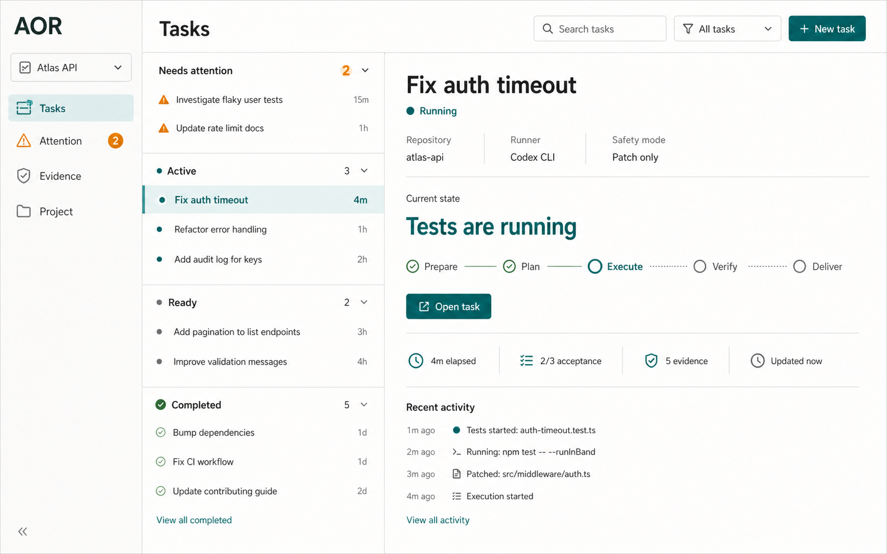
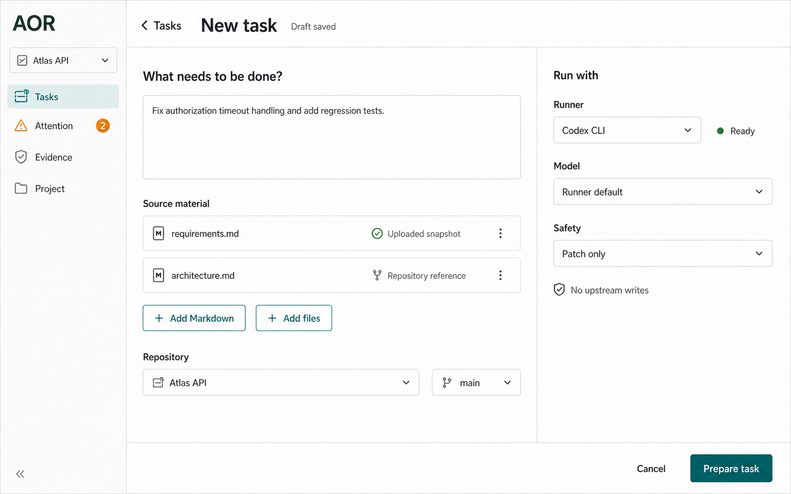
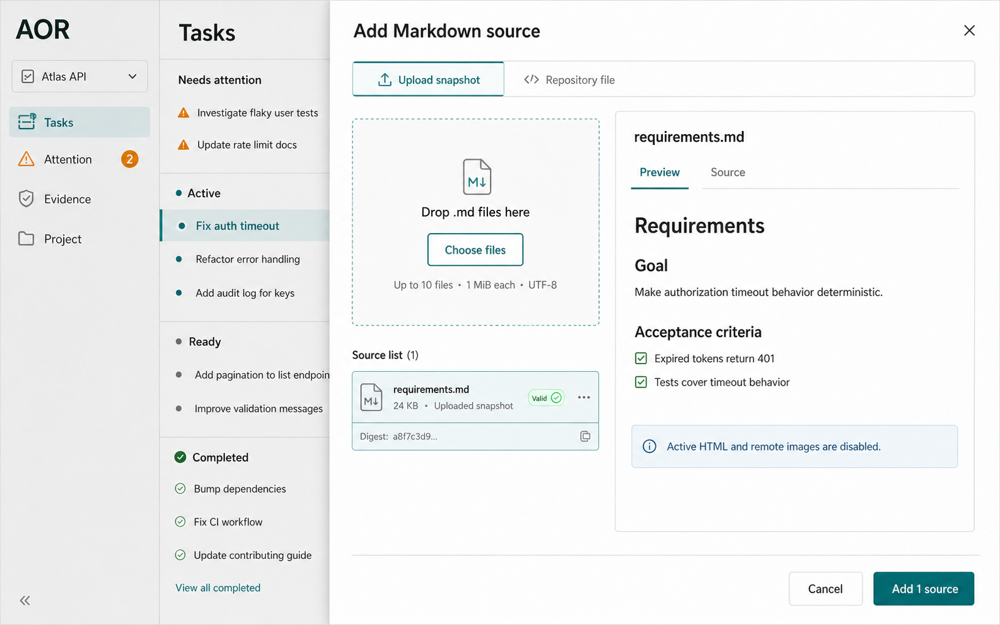
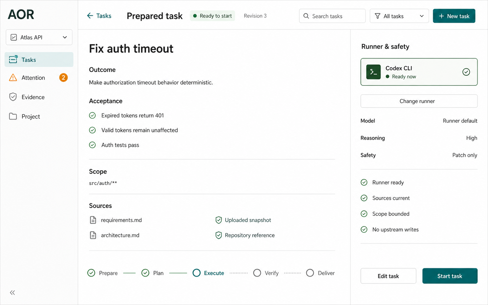
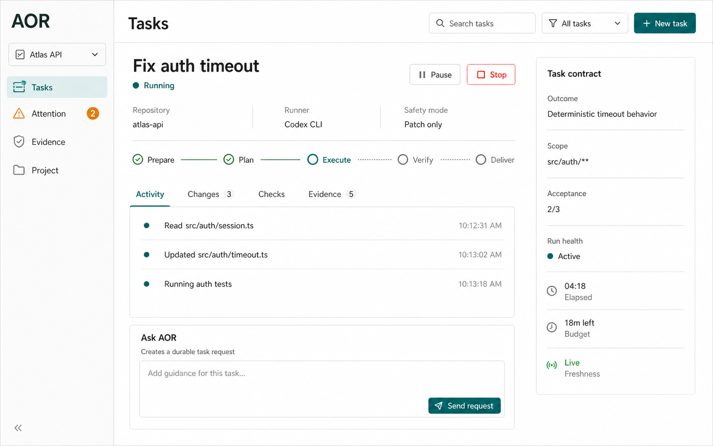
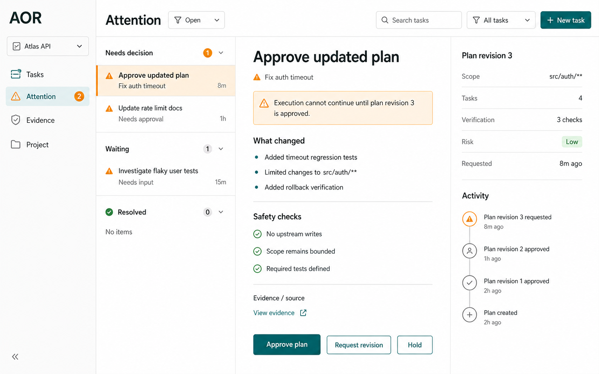
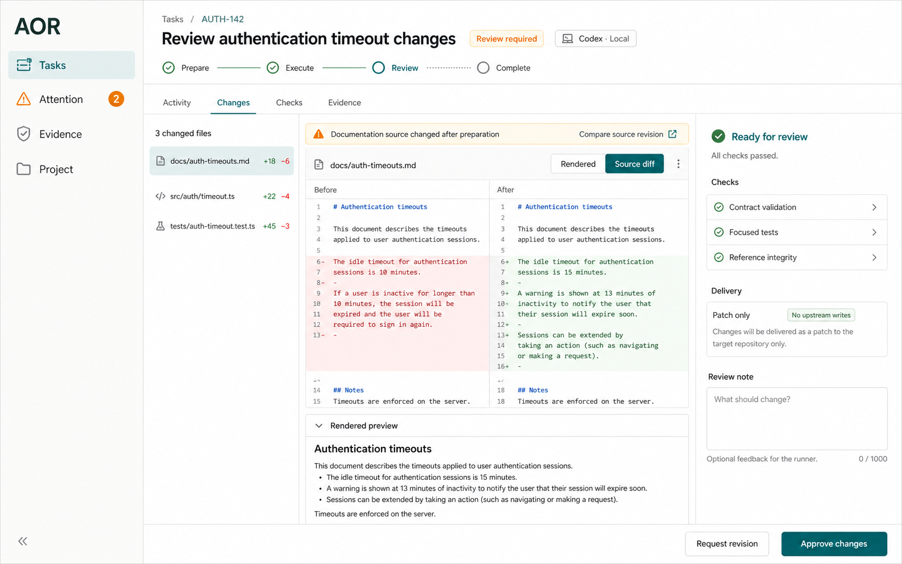
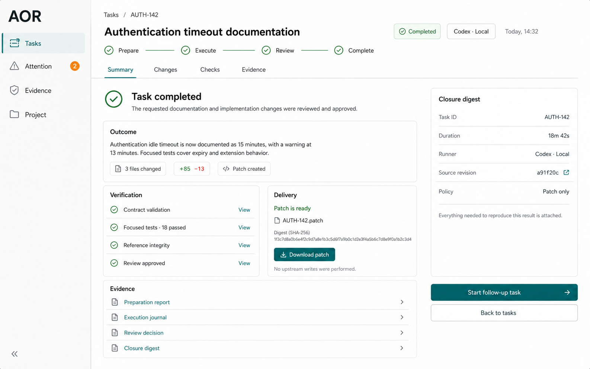

# Task Workspace console target design

This document is the normative UI source of truth for W70. Product, API,
browser-proof, and migration work must use Task-first vocabulary and the
server-owned projection rules below. Historical renderer contracts are retained
in Git history and do not define the packaged surface.

Status: implemented W70 Task Workspace product and visual baseline. W71 owns
post-W70 runtime remediation and current integrated installed-lifecycle proof.

## Product outcome

An installed user works with one primary object: a **Task**. AOR keeps Intent,
Mission, Flow, Run, packet, route, and evidence identities durable, but presents
them only where they help explain state or safety.

The default journey is:

`Project -> Task -> Prepare -> Start -> Work -> Review -> Complete`

## Information architecture

- **Tasks** is the default project home and contains drafts, attention, active,
  ready, and completed tasks.
- **Attention** is a durable work queue for questions, approvals, failed gates,
  and recovery. It is not activity history.
- **Evidence** is a searchable project index; task-scoped evidence remains
  available inside the selected Task.
- **Project** contains repositories, runner defaults, readiness, topology,
  export, and destructive project-data actions.
- A selected Task opens one workspace with `Activity`, `Changes`, `Checks`, and
  `Evidence` tabs. Lifecycle is a compact status path, not a second navigation.

## Migration map

| Current concept or surface | Task Workspace destination | Rule |
|---|---|---|
| Legacy project/Flow navigation | Tasks Home | Show user-facing Tasks; preserve `flow_id` in durable detail and URLs where required. |
| Guided Mission intake | New Task | Ask for outcome and sources first; keep normalization and Mission creation server-owned. |
| Execution Setup | New Task Runner and Project defaults | Expose approved choices and readiness without raw profile editing. |
| Flow Cockpit | Active Task Workspace | Keep activity, controls, freshness, budget, and current safe action in one Task context. |
| Attention mode and Interactions | Attention | Merge only the queue presentation; preserve distinct durable action contracts. |
| Journey workbench | Task lifecycle and Activity | Use the compact lifecycle for orientation and disclose topology only when it affects work. |
| Evidence mode | Task Evidence plus project Evidence index | Prefer task-scoped lineage; retain cross-task search as a secondary destination. |
| Review, QA, and Delivery workbenches | Review Changes and Completion | Present change, check, approval, delivery, and closure effects as one review-to-complete path. |
| Ask AOR | Task guidance composer | Create the existing durable bounded operator request; never imply direct runner chat. |

The migration removes duplicate navigation and presentation concepts. It does
not merge runtime mutations, discard evidence types, or move lifecycle state
into the browser.

## Runtime-owned actions

Action labels describe their actual effect. Controls consume the structured
`operator_control` projection in the [next-action report](../contracts/next-action-report.md);
CLI command text is diagnostic and must not be parsed to select browser behavior.
Unknown, unavailable, or stale actions remain blocked. Successful mutation
feedback requires durable control-plane readback for the same Task and revision.

Ask AOR uses the [operator-request contract](../contracts/operator-request.md).
It preserves the created request identity across run failure and recovery, so a
retry resumes that request instead of creating another one. Operator requests
remain distinct from runtime-initiated interaction answers.

Completed Tasks and their internal Flow evidence are immutable. A follow-up
creates fresh submission and Mission lineage and may cite the completed source
without modifying it. These requirements remain runtime-owned across every
presentation change.

## Screen inventory

1. **Tasks Home** — scan and resume work; primary action `New task`.
2. **New Task** — describe the outcome, add source material, choose repository,
   runner, and safety; primary action `Prepare task`.
3. **Markdown Sources** — add an uploaded snapshot or a repository Markdown
   reference, inspect metadata, and preview safely.
4. **Prepared Task** — review outcome, acceptance, scope, path, runner, and
   write effects; primary action `Start task`.
5. **Active Task Workspace** — monitor current work, send a durable operator
   request, inspect changes/checks/evidence, pause, or stop.
6. **Attention** — resolve one authoritative human decision with consequence,
   source evidence, and durable readback.
7. **Review Changes** — review file tree, Markdown/code diff, checks, and
   delivery effects before accepting or requesting revision.
8. **Completion and Evidence** — inspect outcome, verification, delivery, and
   evidence lineage; primary action `Start follow-up task`.

## Target screens

These images are the W70 visual acceptance target. They define hierarchy,
density, copy, and state visibility; runtime and contract ownership remain
normative in their owning sources.

### 1. Tasks Home

### 2. New Task

### 3. Markdown Sources

### 4. Prepared Task

### 5. Active Task Workspace

### 6. Attention

### 7. Review Changes

### 8. Completion and Evidence

The desktop images above remain the primary W70 visual target. The committed
same-content mobile companion set at 390 × 844 is available under
`assets/w70-task-workspace-console/mobile/01-tasks-home-390x844.png` through
`08-completion-evidence-390x844.png`. The installed browser closure also writes
the sampled WCAG contrast results to
`assets/w70-task-workspace-console/task-workspace-contrast-report.json`.
These artifacts are responsive acceptance evidence for the same eight states,
not a separate product surface.

## Markdown source model

Markdown is source material, not a hidden execution channel or a general-purpose
editor.

### Add modes

- **Upload snapshot:** read a local `.md` file, store an immutable bounded UTF-8
  attachment, show filename/size/digest, and never retain the client path.
- **Repository reference:** select a project-relative `.md` file from the
  connected repository, pin repository/base revision plus digest, and detect a
  stale source before confirmation.
- **Paste text:** keep short requirements in the Task request instead of
  materializing a synthetic file.

### Interaction rules

- Drag/drop and file picker share the same validation and limits.
- Every file row has `Preview`, `Remove`, source type, size, and validation.
- Preview defaults to sanitized rendered Markdown and offers `Source` as a
  secondary tab. Raw HTML, scripts, remote embeds, and automatic remote image
  loads are disabled. Links show their destination before opening.
- Input snapshots are immutable. Replacing or removing a source creates a new
  submission/revision; it never rewrites the original attachment.
- Repository references become stale when the base revision or digest changes.
  The user must refresh the snapshot or explicitly keep the pinned revision.
- A document-change Task shows the resulting `.md` file in Review Changes with
  rendered before/after and source diff views. Accepting a prepared task does
  not itself edit the repository document.
- Attachment bodies, local paths, and unsanitized HTML never appear in list,
  evidence, or telemetry read models.

## Runner interaction

- The New Task and Prepared Task screens show a human-readable Runner control.
- Each option exposes readiness, location, capabilities, model/effort summary,
  and recovery. Disallowed routes are omitted; approved but unavailable routes
  remain visible and disabled with a recovery action.
- `Project default` and `Task override` are distinct. Route IDs, adapter IDs,
  qualification, fallback, and policy remain under `Route details`.
- Changing Runner re-runs readiness and does not start a provider.
- Start remains disabled until the selected runner, source material, task
  revision, and write-back policy are current.

## Visual system

- Calm light operational workspace: warm-white canvas, white surfaces,
  charcoal text, restrained teal action accent, amber attention, red danger.
- Fixed left navigation, compact top context bar, bounded content width, and an
  optional right inspector. No hero layout, gradients, glow, or nested-card
  decoration.
- Relaxed density for New/Prepared Task; compact density for lists, activity,
  evidence, and diffs.
- Page title 28px, section title 18px, body 14px, label/status 12px; tabular
  figures for time, budgets, counts, and diffs.
- 8px surface radius, 6px controls, one-pixel separators, scarce elevation.
- One visually dominant action per state. Destructive actions are never placed
  beside routine task creation or source attachment.

## State contract

Every screen covers loading, empty, partial/stale, error, permission denied,
offline/reconnect, disabled, success, and keyboard focus. Active Task additionally
covers queued, running, interaction-required, paused, canceling, failed,
repairing, and completed. Narrow layouts replace the right inspector with a
drawer and keep state, safety, and the primary action visible.

## Acceptance criteria

- A first-time user can create and start a bounded Task without learning Flow,
  route, packet, or runtime-storage vocabulary.
- A returning operator can find any active or attention Task in two actions.
- Runner and write-back mode are visible before preparation and before start.
- Markdown inputs are distinguishable as immutable uploads or pinned repository
  references and are previewed without active content or hidden network access.
- Runtime-owned state and actions retain their existing durable owners.
- Desktop, tablet, mobile, keyboard-only, 200% zoom, and reduced-motion browser
  evidence match the target screen set under
  `docs/product/assets/w70-task-workspace-console/`.
