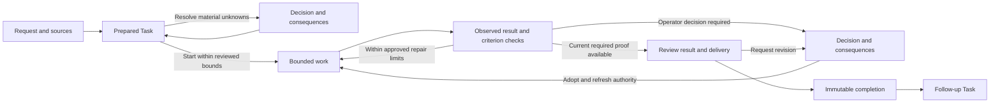

# Iterative Task UX direction

Status: W72 design direction; implementation and usability acceptance are
pending. [Project positioning](01-project-description.md) owns the product
promise. [W72](../backlog/wave-72-implementation-slices.md) owns delivery.
The [W70 baseline](08-task-workspace-console-design.md) and
[Command Desk refinement](09-command-desk-task-workspace-refinement.md) retain
their implemented scope until an explicit W72 cutover.

## Brief and users

Design for repository maintainers, technical leads, reviewers, and operators
who delegate bounded software work to existing runners. The primary job is to
understand the requested behavior, resolve consequential choices, and assess a
verified result. The platform is the installed responsive Task Workspace,
with the same actions and authority available through CLI/API.

Use the current Command Desk components and semantic tokens. Keep Prepare
read-only, Start explicit, lifecycle state in the headless core, mutable state
in AOR Home, and upstream writes subject to existing policy. Product copy must
distinguish intended outcomes, observed results, and missing evidence.

Success means correct Start and review decisions, detection of contradictory
requirements, understandable recovery, and lower unnecessary review effort.
The comparative improvement claim requires S15's human observations.

## Current observations

The [captured baseline](assets/w72-iterative-ux-baseline/README.md) contains
five current-renderer screens observed with the repository's local UI fixture.
It supports presentation findings, with explicit fixture and viewport limits:

- Tasks Home provides useful attention/active/ready/completed grouping, but
  narrow detail columns truncate status and proof labels.
- Prepared Task separates outcome and scope from prominent runner details.
  Its missing-data fixture shows a success glyph beside unpublished acceptance;
  Start remains unavailable in that captured state.
- Active Task defaults to Activity; expected behavior and acceptance are in a
  secondary inspector, while logs may contain no useful result yet.
- Review defaults to a file diff and aggregate checks. The initial view does
  not connect each expected behavior to its observed result and evidence.
- Attention has a durable queue, but the captured generic-action fixture lacks
  a consequence comparison and its three-column layout overlaps at 1280px.

These observations guide design work. They do not prove the complete installed
workflow, human comprehension, or accessibility compliance.

## Journey

The graph describes presentation intent. Runtime policy may block a transition,
require additional preparation, or keep work paused while a revision is adopted.
No UI transition authorizes an unavailable server action.

## Information architecture

Keep global **Tasks**, **Attention**, **Evidence**, and **Project** destinations.
Tasks is the default landing surface. Attention lists required decisions and
recoverable blockers; Evidence supports cross-Task lookup and returns to the
owning Task. Project keeps its current connection/switching scope.

Inside a Task, propose **Overview** as the default work/review section, followed
by the existing **Activity**, **Changes**, **Checks**, and **Evidence** sections.
Overview contains expected behavior, current observations, criterion coverage,
and the next required decision. Detailed files, logs, specifications, plans,
and technical identities open from their related item. They retain direct access
for expert reviewers and policy-required inspection.

Decisions stay in Task context and Attention. A conversation is available for
bounded requests and explanation; an adopted requirement change has its own
explicit runtime action and readback. Sending Ask AOR text does not adopt it.

## Screens and hierarchy

| Surface | First visible content | Primary action and depth |
| --- | --- | --- |
| Tasks Home | Task title, human-readable state, next decision/blocker, current criterion coverage, freshness. | Open the selected Task or New task; runner and technical IDs are secondary. |
| New Task | Requested result, constraints/forbidden behavior, source material, project. | Prepare task with explicit preparation runner/readiness and read-only effects; advanced configuration remains disclosed. |
| Prepared Task | Original request, effective outcome, mandatory behavior, material assumptions/unknowns, allowed and forbidden scope. | Start task after showing budget, commands, write mode, runner, and required decisions for that exact revision. |
| Work Overview | Current attempt/iteration, observed result, verified/failed/unknown criteria, remaining budget, next action. | The current server-published action; pause/stop and detailed Activity remain accessible. |
| Task decision / Attention | The question, why it is needed, affected behavior, options and consequences, source evidence. | A named choice with an inspectable adoption preview; generic approval text alone is insufficient. |
| Review Overview | Expected versus observed behavior, negative requirements, criterion evidence, remaining gaps, delivery effect. | Approve changes or Request revision when permitted; open related file diff or detailed check directly. |
| Requirement revision | Proposed before/after behavior, affected criteria, scope/budget/permission changes, stale outputs. | Apply the revision through the published boundary; show whether work is paused and renewed approval is required. |
| Completion | Achieved outcome, current verified criteria, known limitations, exact delivered output, adopted decisions. | Start follow-up task; the completed Task remains immutable. |

Prepared Task uses a compact review summary with direct editing links, preserving
values and returning to the same review context. This adapts the
[GOV.UK check-answers pattern](https://design-system.service.gov.uk/patterns/check-answers/)
to the existing Prepare/Start boundary. It does not add a mandatory wizard step
or a scroll-to-approve acknowledgment.

Group long criteria by behavior, preserve stable IDs and all mandatory/negative
requirements, and disclose detailed proof inline. No fixed summary length may
silently drop an important constraint. Show which review depth policy requires.
Put failed, unknown, or stale criteria before verified ones in Review; keep
their stable IDs and negative-requirement labels when the order changes.

## Decision and proof example

For a Task about timeout handling, the original request forbids automatic
retries. A generated candidate proposes one automatic retry. The decision view
shows the contradiction before adoption:

| Item | Candidate | Proposed effective behavior |
| --- | --- | --- |
| Timeout result | Automatically retry once. | Report timeout and offer manual retry. |
| Negative criterion | Missing. | No automatic network retry occurs. |
| Work effect | Retry implementation and associated tests. | Manual control and a test observing zero automatic retries. |

The user can choose manual retry, revise the request, or reject the proposal
through the available action. The preview links the affected criterion and
source. Success feedback appears only after the effective revision is read back.
If work is active, show its pause/fencing/replan status and affected old proof.

Review then shows expected behavior, observed behavior, pass/fail/unknown,
exact evidence, and revision freshness for each criterion. A passing unit-test
command without an observation of the negative criterion leaves it unknown.
An agent's explanation remains a claim until the verification producer confirms
it. Manual verification is available only where policy defines who may attest
and what evidence is required.

## State and recovery matrix

The [accepted architecture](../architecture/17-iterative-task-architecture.md)
separates Task lifecycle, unit execution, and scoped blockers. Overview may
therefore show work continuing while a decision blocks only affected units.
Core publishes the permitted actions; resolving one blocker never clears the
others. Delivery permission binds the exact reviewed result and destination.

| State | Visible treatment | Available recovery |
| --- | --- | --- |
| Empty project | Explain what a Task does and how Prepare differs from Start. | Connect/select project and New task; show prerequisites inline. |
| Preparing / loading | Show accepted submission identity, progress or last observation, and read-only effect. | Return to Tasks and resume following the same accepted request. |
| Partial / missing contract | Label unpublished fields and required blockers as unknown; no success glyph. | Edit or resume preparation through the published action; Start stays blocked. |
| Required decision | Keep the consequence comparison and source available together. | Choose, revise, reject, or pause as permitted; preserve a local unsubmitted draft. |
| Action pending | Distinguish submission accepted from decision applied and work resumed. | Follow the same durable identity; prevent duplicate submissions. |
| Worker quiet / long-running | Show last event time, current step, observed health, and remaining bounds. | Inspect Activity or use available pause/stop; elapsed time alone is not progress. |
| Criterion failed / unknown | State what failed or lacks proof and how it affects closure. | Inspect the observation, request bounded repair, or provide permitted verification. |
| Stale evidence or concurrent revision | Mark affected results stale and show the current revision. | Refresh and review the change; keep local draft input separate from current authority. |
| Budget / repair limit reached | Show completed work, remaining gaps, and the exhausted bound. | Stop, start a follow-up, or review a separately approved expansion. |
| Error / partial integration | Preserve successful and failed per-unit results plus aggregate blockers. | Use the runtime's named recovery action; one successful repository cannot imply overall completion. |
| Offline / reconnecting | Retain last known data with freshness and disabled unavailable mutations. | Reconnect and read back pending actions before retrying; work remains runtime-owned. |
| Completed Task | Show immutable achieved scope and the recorded requirement revision, proof, and delivered output. | Create a follow-up Task with explicit source lineage. |

## Interaction and visual rules

- Use one primary action for the current operator job, with its effect and
  blocker/recovery explanation adjacent. Technical route selection remains
  available without visually dominating expected behavior or proof.
- Keep the Command Desk dark rail, light canvas, semantic color roles, and
  existing Glyph/Button/Dialog/tab primitives. Reuse typography and spacing
  tokens; reduce competing headings and ornamental metrics.
- Use a two-region work layout where space permits: behavior/result in the
  main region and decision/bounds in the supporting region. Open the file
  explorer for technical review without permanently shrinking the result view.
  At smaller widths use ordered sections and a focus-managed details drawer.
- Task headings and actions may wrap. Reflow queue/search controls outside the
  detail header when necessary. Preserve readable diff width and confine any
  code scrolling to its own region. Do not truncate a decision's consequence,
  blocker, criterion, or primary action.
- Status combines text, icon, and semantic tone. Runner readiness, criterion
  verification, review approval, and delivery status remain distinct. Show
  counts such as verified/required plus failed/unknown counts; avoid a guessed
  completion percentage or an evidence-file count as a quality score.
- Editing expected behavior produces an inspectable candidate revision. A
  changed scope, budget, permission, or delivery effect requires the runtime's
  corresponding approval. Record the adopted actor/version and invalidate old
  proof rather than silently changing a running Task.
- Keep focus stable during background updates. Dialogs return focus to their
  trigger; tab navigation uses the existing keyboard primitives. Announce
  meaningful submission, adoption, failure, and resume status without flooding
  the live region. See [W3C status messages](https://www.w3.org/WAI/WCAG22/Understanding/status-messages.html).
- Sticky actions and drawers must keep the focused control visible. Verify
  keyboard operation, 200% zoom, reduced motion, and layouts at 390, 768, 1280,
  and 1440px. See [W3C focus not obscured](https://www.w3.org/WAI/WCAG22/Understanding/focus-not-obscured-minimum.html).

## Validation and ownership

The [interactive screen prototype](prototypes/iterative-task/README.md) provides
Prepared Task, decision adoption, and criterion-first Review fixtures using the
current Command Desk tokens and primitives. It includes the manual-retry
contradiction, explicit Start review, proof inspection, missing/stale evidence,
budget and offline recovery, and a local acceptance preview. Its
[design QA](prototypes/iterative-task/design-qa.md) records rendered and
interaction evidence. This is partial S17 preparation, not runtime or human
comprehension evidence; active revision, other work types, and the complete
state inventory remain part of the slice.

S01 finalizes positioning, behavior examples, decision boundaries, and the
predeclared comparison protocol. S02-S06 can establish requirement and closure
correctness independently of formative participant scheduling. S17 produces
the screen/state inventory, visual targets, a clickable fixture prototype, and
formative usability evidence before S10 fixes public projection/action contracts.
S11 implements the accepted
design against S10's real control plane. S15 measures the implemented journey
against the original baseline; S16 proves the installed package and cutover.

S17 initially targets 5-6 formative participants with mixed engineering and
review experience. Observe unprompted Start explanations, seeded contradiction
detection, option/consequence comprehension, criterion-proof lookup, and
failure recovery. Record task/version identities, assistance, errors, and
limits. Fix critical authorization or success-state misunderstandings before
freezing the UI target. This is design feedback; S15 owns the later comparative
human-comprehension claim and its independent acceptance thresholds.

UX acceptance requires:

1. The operator can inspect original/effective behavior and all material Start
   bounds from the prepared review context.
2. Decisions show changed behavior, affected criteria, consequences, and durable
   adoption; receiving an answer or sending a request cannot look like adoption.
3. Review links each current criterion to expected/observed behavior and proof,
   and makes unknown/failed/stale evidence visibly block the relevant action.
4. All matrix states have named recovery, preserve accepted action identities,
   and operate through the same headless authority.
5. Responsive, keyboard, zoom, and assistive-technology checks demonstrate the
   defined interactions; fixture screenshots alone cannot close these checks.
6. Formative findings inform the selected design, and final improvement claims
   use the separately predeclared S15 observations.

## Open questions and handoff

- Validate whether Overview grouping makes large criteria sets easier to review
  while preserving negative requirements; choose the grouping from S17 sessions.
- Validate the density and disclosure level for frequent CLI/API operators and
  occasional reviewers; preserve one authority across presentation preferences.
- Arrange the formative cohort and the later comparison cohort before their
  respective slices can close. Participant recruitment/messaging needs its
  own authorization; a prototype walkthrough is not participant evidence.

Hand the accepted S17 design and data/action requirements to S10 and S11,
binding the effective requirements and verification contracts established by S02.
Update this source with the selected visual target and findings, then align
W70/W71 navigation references only at the explicit W72 cutover boundary.
