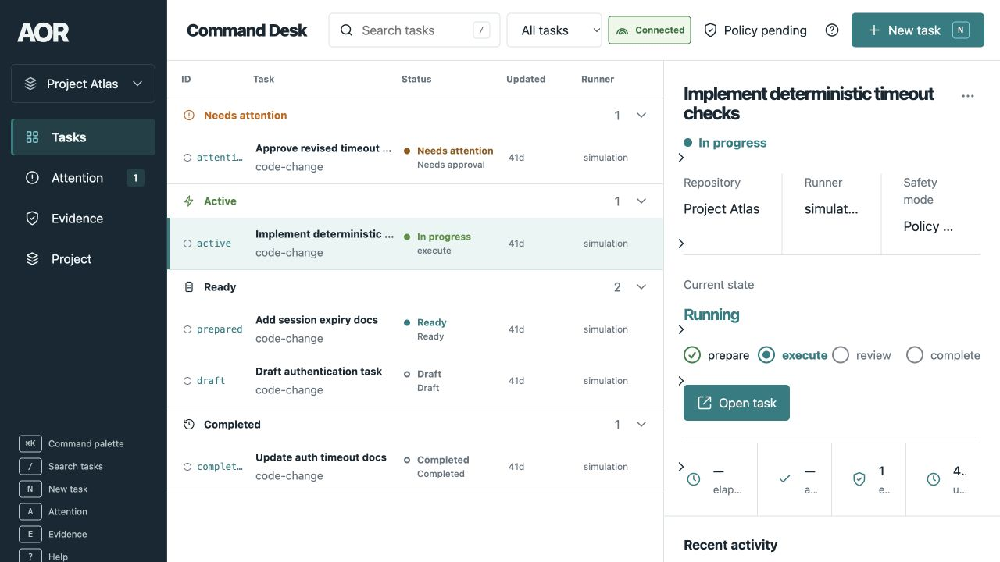
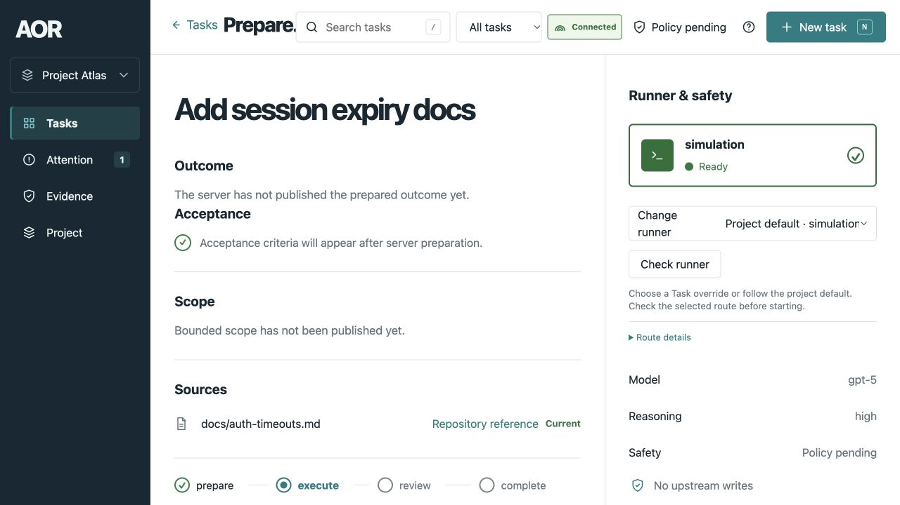
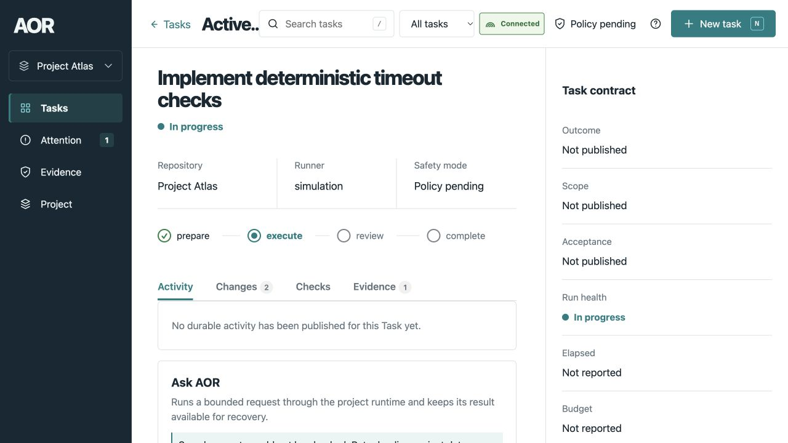
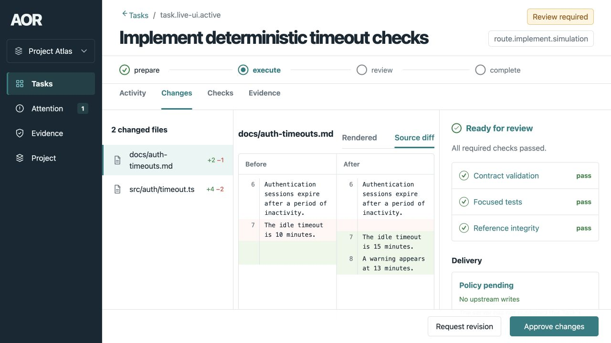
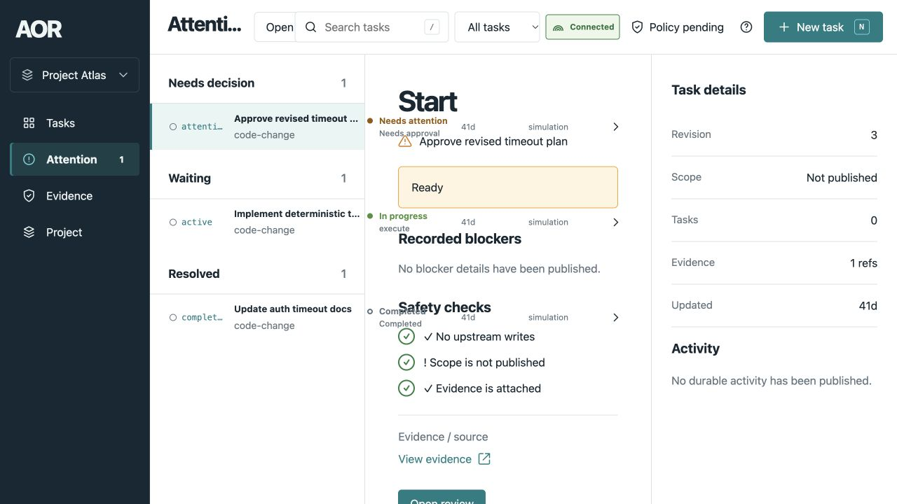

# W72 current-renderer UX observations

Captured on 2026-10-01 through the Codex in-app browser at 1280x720.
Source baseline: `fe77035c28802e9e3dcccb42b8ff2a9978744f17`.
The inspected web source and packaged `apps/web/dist` were unchanged during
capture. The current working tree contained W72 planning/documentation edits.

The capture used [the local UI fixture](../../../../apps/web/browser/live-ui-fixture.mjs)
serving the existing packaged renderer with synthetic Project Atlas Tasks.
No coding runner, paid provider, approval mutation, or real target checkout was
used. All five saved screenshots were opened and inspected after saving.

These observations support the [planned UX direction](../../10-iterative-task-ux.md).
They are current fixture presentation evidence, with separate states selected
through the UI; they are not a real execution trace, usability study, installed
journey acceptance, or proof of W72 behavior.

## 1. Tasks Home — useful queue, constrained detail

Attention/active/ready/completed grouping and a selected-Task detail region make
work easy to locate. Short technical IDs, duplicated status text, truncated
metadata, and unavailable acceptance metrics compete with the task outcome.
W72 should emphasize the next decision and actual criterion coverage, keep
technical identity available in detail, and preserve readable column widths.

## 2. Prepared Task — bounds visible, missing-data treatment needs clarity

Outcome, acceptance, scope, and sources have named sections, and runner choice
remains explicit. The fixture omits the prepared contract and delivery policy:
the renderer displays unpublished fields with a green acceptance glyph, while
the Start action is unavailable. This demonstrates fallback presentation, not
the completeness of a real prepared Task. The crowded toolbar also obscures
the page title. W72 should distinguish unknown criteria from passing checks
and keep behavior plus material Start bounds readable together.

## 3. Active Task — stable context, result needs a primary view

Task state, project, runner, safety, lifecycle, and detailed tabs remain in one
context. The captured Activity is empty and the contract inspector contains
unpublished fixture values; the initial view offers no criterion/result map.
W72 should provide an Overview of current observations and verification gaps
with Activity available for deeper inspection. Missing observations must remain
explicitly unknown rather than turning elapsed time into progress.

## 4. Review Changes — inspectable diff, aggregate proof

Changed files, before/after content, review actions, and delivery detail are
available together. The initial view emphasizes a narrow file diff and general
passing check labels, with no per-criterion expected/observed/evidence mapping.
The fixture publishes aggregate verification/delivery pass without a prepared
policy; it cannot establish current authorization correctness. W72 should
default to behavior and proof, with a sufficiently wide file view on demand.
The source renderer for this view is
[ReviewScreen](../../../../apps/web/src/task-workspace.jsx).

## 5. Attention — durable destination, generic consequence presentation

The screen groups decisions, waiting Tasks, and resolved work with evidence and
review links. The synthetic attention Task publishes a generic Start action
and omits blocker details: its action title cannot explain a product decision.
At this viewport, queue text overlaps the center region and the header is
crowded. W72 should name the actual decision, show before/after behavior and
consequences, and use a layout that reflows without overlap.

## Evidence limits and design handoff

The screenshots confirm these rendered states and visible hierarchy. The
missing prepared contract, old timestamps, unknown budgets, and unavailable
Ask AOR read surface are fixture characteristics. They must not be reported as
proof that equivalent installed runtime data is absent or broken.

New Task/source entry, actual question adoption, active replan, completion,
offline recovery, responsive layouts, keyboard focus, screen readers, and
contrast measurements were not exercised in this capture. Those checks belong
to the S17 design/prototype matrix and S11/S16 runtime/browser acceptance.
No accessibility compliance or comparative comprehension claim is made.

Retain the queue, Task context, existing visual tokens, and expert drilldown.
Use these observations to validate Prepared Task, Overview, decision comparison,
behavior-to-proof review, and responsive layout in W72-S17 before fixing the
S10 public projection/action contracts and implementing the S11 UI.
